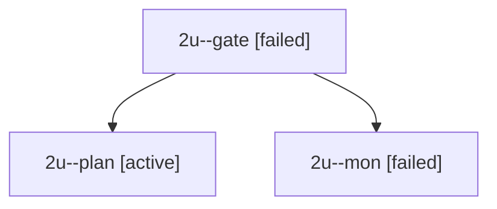

# Session: 2u

[Agent Hoods](../README.md) / [bbugyi200](../users/bbugyi200/README.md) / [apollo](../users/bbugyi200/machines/apollo/README.md) / [2u](../users/bbugyi200/machines/apollo/hoods/2u/README.md) / 2u

Owner: `bbugyi200.apollo` · Hood: `2u` · Members: 3

## Lineage

The diagram is an optional enhancement; the ordered table below contains the same lineage in accessible text.

| Role | Agent | State | Model / provider | Timing | Commits | Prompt | Chat |
|---|---|---|---|---|---:|---|---|
| gate | 2u--gate | failed | opus / claude | 2026-09-28T20:46:06.415291+00:00 → 2026-09-28T20:46:16.492094+00:00 | 0 | — | [Chat](../agents/bbugyi200.apollo.2u--gate/chat.md) |
| plan | 2u--plan | active | opus / claude | 2026-09-28T20:40:13.050254+00:00 | 0 | [Prompt](../agents/bbugyi200.apollo.2u--plan/prompt.md) | [Chat](../agents/bbugyi200.apollo.2u--plan/chat.md) |
| mon | 2u--mon | failed | opus / claude | 2026-09-28T20:46:15.552818+00:00 → 2026-09-28T20:50:01.513983+00:00 | 0 | — | [Chat](../agents/bbugyi200.apollo.2u--mon/chat.md) |

## Commits

| Role | Repo | Commit | Subject | Committed |
|---|---|---|---|---|
| — | bob-cli | [`2de8b08`](https://github.com/bobs-org/bob-cli/commit/2de8b0876d85055f8134baff84181c1cf8438c34) | chore: Add SDD prompt and plan for new\_note\_created\_field | 2026-06-06 06:58:33 EDT |
