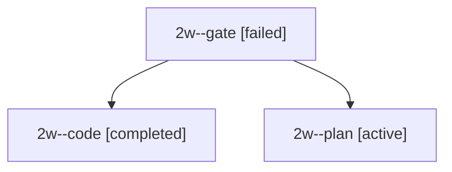

# Session: 2w

[Agent Hoods](../README.md) / [bbugyi200](../users/bbugyi200/README.md) / [apollo](../users/bbugyi200/machines/apollo/README.md) / [2w](../users/bbugyi200/machines/apollo/hoods/2w/README.md) / 2w

Owner: `bbugyi200.apollo` · Hood: `2w` · Members: 3

## Lineage

The diagram is an optional enhancement; the ordered table below contains the same lineage in accessible text.

| Role | Agent | State | Model / provider | Timing | Commits | Prompt | Chat |
|---|---|---|---|---|---:|---|---|
| gate | 2w--gate | failed | opus / claude | 2026-09-28T20:19:53.689426+00:00 → 2026-09-28T20:20:01.589026+00:00 | 0 | — | [Chat](../agents/bbugyi200.apollo.2w--gate/chat.md) |
| code | 2w--code | completed | muse-spark-1.3-contributor / muse | 2026-09-28T20:20:07.181236+00:00 → 2026-09-28T20:41:45.499312+00:00 | [1](../agents/bbugyi200.apollo.2w--code/README.md#commits) | — | [Chat](../agents/bbugyi200.apollo.2w--code/chat.md) |
| plan | 2w--plan | active | opus / claude | 2026-09-28T20:00:04.622460+00:00 | 0 | [Prompt](../agents/bbugyi200.apollo.2w--plan/prompt.md) | [Chat](../agents/bbugyi200.apollo.2w--plan/chat.md) |

## Commits

| Role | Repo | Commit | Subject | Committed |
|---|---|---|---|---|
| — | bob-cli | [`d3e0211`](https://github.com/bobs-org/bob-cli/commit/d3e02110e98b0820c32f3f0d5158ee456b2e8113) | chore: Add SDD prompt and plan for obsidian\_enter\_repeat\_explicit\_fix | 2026-06-06 07:36:39 EDT |
| — | bob-cli | [`962e510`](https://github.com/bobs-org/bob-cli/commit/962e510f2034505a7fcb347a32e765003d2c7e86) | chore: Mark SDD plan done | 2026-06-06 07:38:26 EDT |
| code | bob-cli | [`c603111`](https://github.com/bobs-org/bob-cli/commit/c603111d7d231e1fee673850175d8a702064d197) | fix(gkeep): finish bob-cli-2d closeout per 202609/gkeep\_land\_resume.md | 2026-09-28 16:40:50 EDT |
