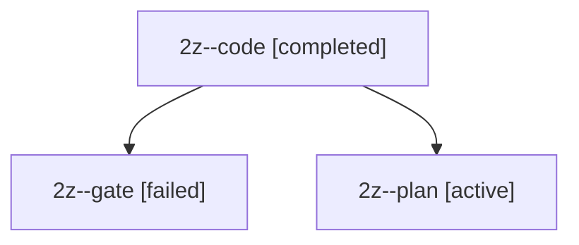

# Session: 2z

[Agent Hoods](../README.md) / [bbugyi200](../users/bbugyi200/README.md) / [apollo](../users/bbugyi200/machines/apollo/README.md) / [2z](../users/bbugyi200/machines/apollo/hoods/2z/README.md) / 2z

Owner: `bbugyi200.apollo` · Hood: `2z` · Members: 3

## Lineage

The diagram is an optional enhancement; the ordered table below contains the same lineage in accessible text.

| Role | Agent | State | Model / provider | Timing | Commits | Prompt | Chat |
|---|---|---|---|---|---:|---|---|
| code | 2z--code | completed | muse-spark-1.3-contributor / muse | 2026-09-29T12:41:33.976859+00:00 → 2026-09-29T12:53:40.407237+00:00 | 0 | — | [Chat](../agents/bbugyi200.apollo.2z--code/chat.md) |
| gate | 2z--gate | failed | opus / claude | 2026-09-29T12:41:20.211958+00:00 → 2026-09-29T12:41:28.241963+00:00 | 0 | — | [Chat](../agents/bbugyi200.apollo.2z--gate/chat.md) |
| plan | 2z--plan | active | opus / claude | 2026-09-29T12:29:52.181603+00:00 | 0 | [Prompt](../agents/bbugyi200.apollo.2z--plan/prompt.md) | [Chat](../agents/bbugyi200.apollo.2z--plan/chat.md) |

## Neighbors

| Agent | Relation | State |
|---|---|---|
| [2z.cdx](../agents/bbugyi200.apollo.2z.cdx/README.md) | descendant | completed |
