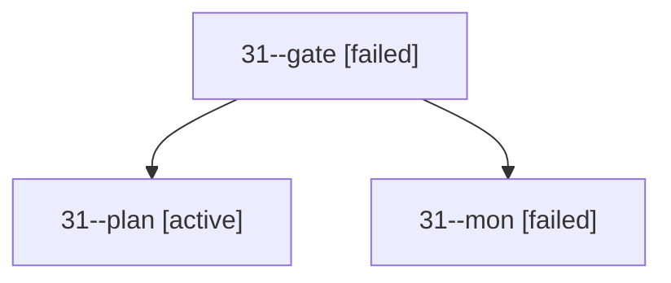

# Session: 31

[Agent Hoods](../README.md) / [bbugyi200](../users/bbugyi200/README.md) / [apollo](../users/bbugyi200/machines/apollo/README.md) / [31](../users/bbugyi200/machines/apollo/hoods/31/README.md) / 31

Owner: `bbugyi200.apollo` · Hood: `31` · Members: 3

## Lineage

The diagram is an optional enhancement; the ordered table below contains the same lineage in accessible text.

| Role | Agent | State | Model / provider | Timing | Commits | Prompt | Chat |
|---|---|---|---|---|---:|---|---|
| gate | 31--gate | failed | opus / claude | 2026-09-29T13:42:52.488405+00:00 → 2026-09-29T13:43:00.408531+00:00 | 0 | — | [Chat](../agents/bbugyi200.apollo.31--gate/chat.md) |
| plan | 31--plan | active | opus / claude | 2026-09-29T13:18:31.322586+00:00 | 0 | [Prompt](../agents/bbugyi200.apollo.31--plan/prompt.md) | [Chat](../agents/bbugyi200.apollo.31--plan/chat.md) |
| mon | 31--mon | failed | opus / claude | 2026-09-29T13:42:59.510946+00:00 → 2026-09-29T13:43:34.028758+00:00 | 0 | — | [Chat](../agents/bbugyi200.apollo.31--mon/chat.md) |
