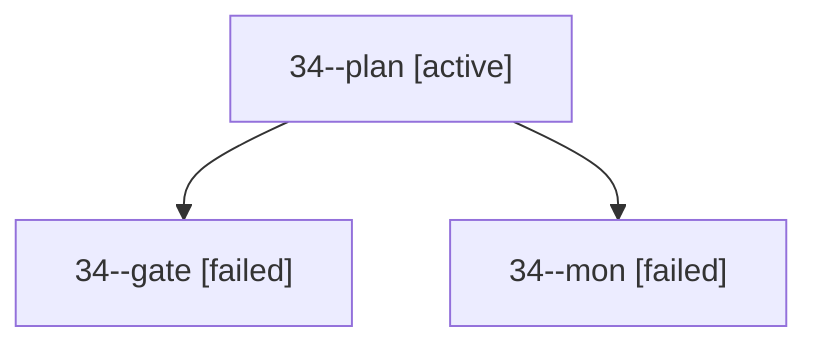

# Session: 34

[Agent Hoods](../README.md) / [bbugyi200](../users/bbugyi200/README.md) / [apollo](../users/bbugyi200/machines/apollo/README.md) / [34](../users/bbugyi200/machines/apollo/hoods/34/README.md) / 34

Owner: `bbugyi200.apollo` · Hood: `34` · Members: 3

## Lineage

The diagram is an optional enhancement; the ordered table below contains the same lineage in accessible text.

| Role | Agent | State | Model / provider | Timing | Commits | Prompt | Chat |
|---|---|---|---|---|---:|---|---|
| plan | 34--plan | active | opus / claude | 2026-09-29T17:26:35.076659+00:00 | 0 | [Prompt](../agents/bbugyi200.apollo.34--plan/prompt.md) | [Chat](../agents/bbugyi200.apollo.34--plan/chat.md) |
| gate | 34--gate | failed | opus / claude | 2026-09-29T17:44:50.369701+00:00 → 2026-09-29T17:44:57.281014+00:00 | 0 | — | [Chat](../agents/bbugyi200.apollo.34--gate/chat.md) |
| mon | 34--mon | failed | opus / claude | 2026-09-29T17:44:56.381299+00:00 → 2026-09-29T17:45:28.572973+00:00 | 0 | — | [Chat](../agents/bbugyi200.apollo.34--mon/chat.md) |
