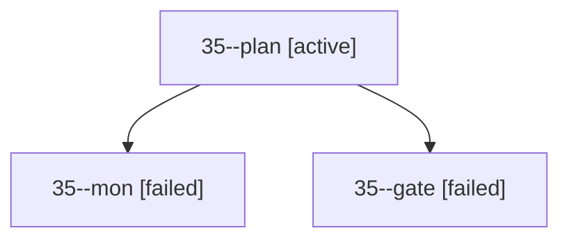

# Session: 35

[Agent Hoods](../README.md) / [bbugyi200](../users/bbugyi200/README.md) / [apollo](../users/bbugyi200/machines/apollo/README.md) / [35](../users/bbugyi200/machines/apollo/hoods/35/README.md) / 35

Owner: `bbugyi200.apollo` · Hood: `35` · Members: 3

## Lineage

The diagram is an optional enhancement; the ordered table below contains the same lineage in accessible text.

| Role | Agent | State | Model / provider | Timing | Commits | Prompt | Chat |
|---|---|---|---|---|---:|---|---|
| plan | 35--plan | active | opus / claude | 2026-09-29T19:11:59.710762+00:00 | 0 | [Prompt](../agents/bbugyi200.apollo.35--plan/prompt.md) | [Chat](../agents/bbugyi200.apollo.35--plan/chat.md) |
| mon | 35--mon | failed | opus / claude | 2026-09-29T19:35:19.449023+00:00 → 2026-09-29T19:35:56.218437+00:00 | 0 | — | [Chat](../agents/bbugyi200.apollo.35--mon/chat.md) |
| gate | 35--gate | failed | opus / claude | 2026-09-29T19:35:14.446624+00:00 → 2026-09-29T19:35:20.176931+00:00 | 0 | — | [Chat](../agents/bbugyi200.apollo.35--gate/chat.md) |
