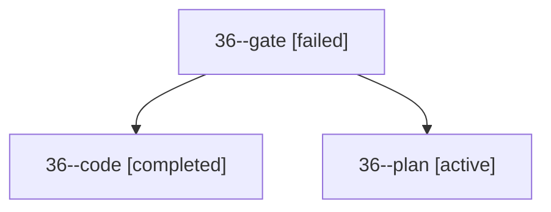

# Session: 36

[Agent Hoods](../README.md) / [bbugyi200](../users/bbugyi200/README.md) / [apollo](../users/bbugyi200/machines/apollo/README.md) / [36](../users/bbugyi200/machines/apollo/hoods/36/README.md) / 36

Owner: `bbugyi200.apollo` · Hood: `36` · Members: 3

## Lineage

The diagram is an optional enhancement; the ordered table below contains the same lineage in accessible text.

| Role | Agent | State | Model / provider | Timing | Commits | Prompt | Chat |
|---|---|---|---|---|---:|---|---|
| gate | 36--gate | failed | opus / claude | 2026-09-29T22:31:01.348483+00:00 → 2026-09-29T22:31:11.036859+00:00 | 0 | — | [Chat](../agents/bbugyi200.apollo.36--gate/chat.md) |
| code | 36--code | completed | muse-spark-1.3-contributor / muse | 2026-09-29T22:31:16.899442+00:00 → 2026-09-29T22:55:27.004386+00:00 | [1](../agents/bbugyi200.apollo.36--code/README.md#commits) | — | [Chat](../agents/bbugyi200.apollo.36--code/chat.md) |
| plan | 36--plan | active | opus / claude | 2026-09-29T22:21:58.415403+00:00 | 0 | [Prompt](../agents/bbugyi200.apollo.36--plan/prompt.md) | [Chat](../agents/bbugyi200.apollo.36--plan/chat.md) |

## Commits

| Role | Repo | Commit | Subject | Committed |
|---|---|---|---|---|
| code | bob-cli | [`dcf7db2`](https://github.com/bobs-org/bob-cli/commit/dcf7db203008eb6ff72283e05caab3f9403836dd) | feat(capture): support same-line Pomodoro session operator chains | 2026-09-29 18:54:43 EDT |

## Neighbors

| Agent | Relation | State |
|---|---|---|
| [36.w0](bbugyi200.apollo.36.w0.md) (session · 3) | descendant | active 1, failed 2 |
