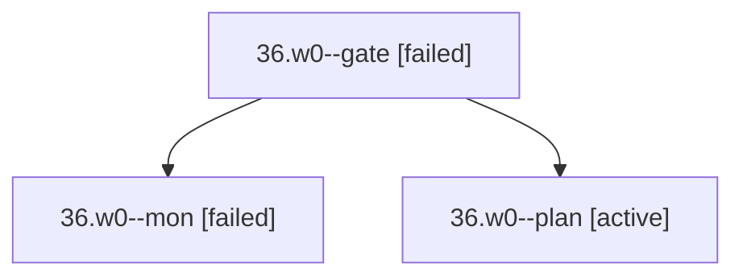

# Session: 36.w0

[Agent Hoods](../README.md) / [bbugyi200](../users/bbugyi200/README.md) / [apollo](../users/bbugyi200/machines/apollo/README.md) / [36](../users/bbugyi200/machines/apollo/hoods/36/README.md) / 36.w0

Owner: `bbugyi200.apollo` · Hood: `36` · Members: 3

## Lineage

The diagram is an optional enhancement; the ordered table below contains the same lineage in accessible text.

| Role | Agent | State | Model / provider | Timing | Commits | Prompt | Chat |
|---|---|---|---|---|---:|---|---|
| gate | 36.w0--gate | failed | opus / claude | 2026-09-29T23:17:46.724122+00:00 → 2026-09-29T23:17:53.240778+00:00 | 0 | — | [Chat](../agents/bbugyi200.apollo.36.w0--gate/chat.md) |
| mon | 36.w0--mon | failed | opus / claude | 2026-09-29T23:17:51.904471+00:00 → 2026-09-29T23:18:30.174915+00:00 | 0 | — | [Chat](../agents/bbugyi200.apollo.36.w0--mon/chat.md) |
| plan | 36.w0--plan | active | opus / claude | 2026-09-29T22:55:53.675303+00:00 | 0 | [Prompt](../agents/bbugyi200.apollo.36.w0--plan/prompt.md) | [Chat](../agents/bbugyi200.apollo.36.w0--plan/chat.md) |

## Neighbors

| Agent | Relation | State |
|---|---|---|
| [36](bbugyi200.apollo.36.md) (session · 3) | ancestor | active 1, completed 1, failed 1 |
