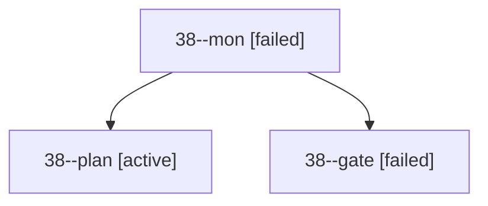

# Session: 38

[Agent Hoods](../README.md) / [bbugyi200](../users/bbugyi200/README.md) / [apollo](../users/bbugyi200/machines/apollo/README.md) / [38](../users/bbugyi200/machines/apollo/hoods/38/README.md) / 38

Owner: `bbugyi200.apollo` · Hood: `38` · Members: 3

## Lineage

The diagram is an optional enhancement; the ordered table below contains the same lineage in accessible text.

| Role | Agent | State | Model / provider | Timing | Commits | Prompt | Chat |
|---|---|---|---|---|---:|---|---|
| mon | 38--mon | failed | opus / claude | 2026-09-29T22:09:49.443809+00:00 → 2026-09-29T22:10:28.481610+00:00 | 0 | — | [Chat](../agents/bbugyi200.apollo.38--mon/chat.md) |
| plan | 38--plan | active | opus / claude | 2026-09-29T21:43:34.675762+00:00 | 0 | [Prompt](../agents/bbugyi200.apollo.38--plan/prompt.md) | [Chat](../agents/bbugyi200.apollo.38--plan/chat.md) |
| gate | 38--gate | failed | opus / claude | 2026-09-29T22:09:43.309374+00:00 → 2026-09-29T22:09:50.574307+00:00 | 0 | — | [Chat](../agents/bbugyi200.apollo.38--gate/chat.md) |

## Commits

| Role | Repo | Commit | Subject | Committed |
|---|---|---|---|---|
| — | bob-cli | [`a708cf5`](https://github.com/bobs-org/bob-cli/commit/a708cf509e8a39269756ff23d7e96ac32ed3e8f6) | chore: Add SDD prompt and plan for transcluded\_ctrl\_enter\_tasks | 2026-06-06 11:10:41 EDT |
