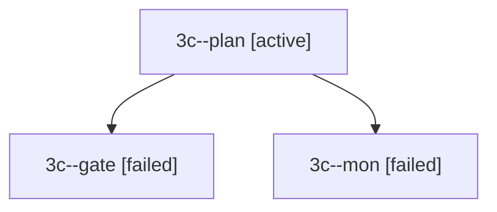

# Session: 3c

[Agent Hoods](../README.md) / [bbugyi200](../users/bbugyi200/README.md) / [apollo](../users/bbugyi200/machines/apollo/README.md) / [3c](../users/bbugyi200/machines/apollo/hoods/3c/README.md) / 3c

Owner: `bbugyi200.apollo` · Hood: `3c` · Members: 3

## Lineage

The diagram is an optional enhancement; the ordered table below contains the same lineage in accessible text.

| Role | Agent | State | Model / provider | Timing | Commits | Prompt | Chat |
|---|---|---|---|---|---:|---|---|
| plan | 3c--plan | active | opus / claude | 2026-09-30T11:23:23.600954+00:00 | 0 | [Prompt](../agents/bbugyi200.apollo.3c--plan/prompt.md) | [Chat](../agents/bbugyi200.apollo.3c--plan/chat.md) |
| gate | 3c--gate | failed | opus / claude | 2026-09-30T11:52:13.549778+00:00 → 2026-09-30T11:52:20.385791+00:00 | 0 | — | [Chat](../agents/bbugyi200.apollo.3c--gate/chat.md) |
| mon | 3c--mon | failed | opus / claude | 2026-09-30T11:52:18.726286+00:00 → 2026-09-30T11:53:07.200778+00:00 | 0 | — | [Chat](../agents/bbugyi200.apollo.3c--mon/chat.md) |
