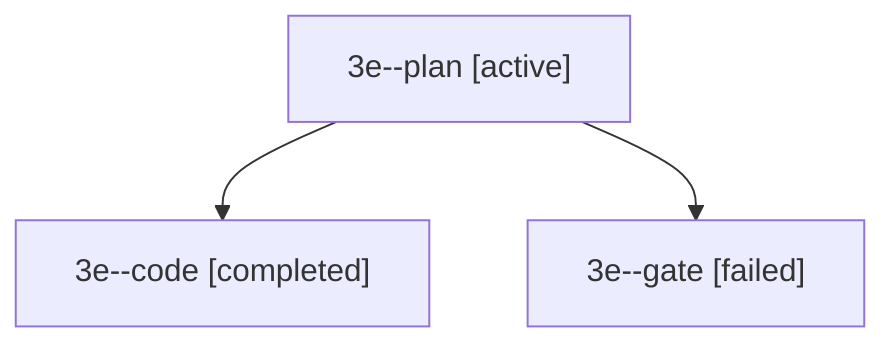

# Session: 3e

[Agent Hoods](../README.md) / [bbugyi200](../users/bbugyi200/README.md) / [apollo](../users/bbugyi200/machines/apollo/README.md) / [3e](../users/bbugyi200/machines/apollo/hoods/3e/README.md) / 3e

Owner: `bbugyi200.apollo` · Hood: `3e` · Members: 3

## Lineage

The diagram is an optional enhancement; the ordered table below contains the same lineage in accessible text.

| Role | Agent | State | Model / provider | Timing | Commits | Prompt | Chat |
|---|---|---|---|---|---:|---|---|
| plan | 3e--plan | active | gpt-6-sol / codex | 2026-09-30T11:48:45.772198+00:00 | 0 | [Prompt](../agents/bbugyi200.apollo.3e--plan/prompt.md) | [Chat](../agents/bbugyi200.apollo.3e--plan/chat.md) |
| code | 3e--code | completed | muse-spark-1.3-contributor / muse | 2026-09-30T11:58:02.793015+00:00 → 2026-09-30T12:03:16.224173+00:00 | 0 | — | [Chat](../agents/bbugyi200.apollo.3e--code/chat.md) |
| gate | 3e--gate | failed | gpt-6-sol / codex | 2026-09-30T11:57:48.276216+00:00 → 2026-09-30T11:57:56.385601+00:00 | 0 | — | [Chat](../agents/bbugyi200.apollo.3e--gate/chat.md) |

## Commits

| Role | Repo | Commit | Subject | Committed |
|---|---|---|---|---|
| — | bob-cli | [`86c30e5`](https://github.com/bobs-org/bob-cli/commit/86c30e5c41dceea186e9741ea8a9182db39579a8) | chore: Add SDD prompt and plan for obsidian\_backslash\_daily\_open\_tab | 2026-06-07 06:15:48 EDT |

## Neighbors

| Agent | Relation | State |
|---|---|---|
| [3e.f1](../agents/bbugyi200.apollo.3e.f1/README.md) | descendant | completed |
| [3e.f1.f1](../agents/bbugyi200.apollo.3e.f1.f1/README.md) | descendant | completed |
