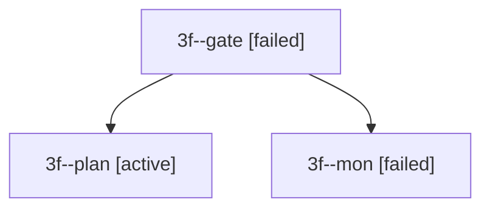

# Session: 3f

[Agent Hoods](../README.md) / [bbugyi200](../users/bbugyi200/README.md) / [apollo](../users/bbugyi200/machines/apollo/README.md) / [3f](../users/bbugyi200/machines/apollo/hoods/3f/README.md) / 3f

Owner: `bbugyi200.apollo` · Hood: `3f` · Members: 3

## Lineage

The diagram is an optional enhancement; the ordered table below contains the same lineage in accessible text.

| Role | Agent | State | Model / provider | Timing | Commits | Prompt | Chat |
|---|---|---|---|---|---:|---|---|
| gate | 3f--gate | failed | opus / claude | 2026-09-30T12:28:18.705794+00:00 → 2026-09-30T12:28:26.360478+00:00 | 0 | — | [Chat](../agents/bbugyi200.apollo.3f--gate/chat.md) |
| plan | 3f--plan | active | opus / claude | 2026-09-30T12:13:13.291867+00:00 | 0 | [Prompt](../agents/bbugyi200.apollo.3f--plan/prompt.md) | [Chat](../agents/bbugyi200.apollo.3f--plan/chat.md) |
| mon | 3f--mon | failed | opus / claude | 2026-09-30T12:28:25.635112+00:00 → 2026-09-30T12:29:00.333655+00:00 | 0 | — | [Chat](../agents/bbugyi200.apollo.3f--mon/chat.md) |

## Commits

| Role | Repo | Commit | Subject | Committed |
|---|---|---|---|---|
| — | bob-cli | [`01f0b5c`](https://github.com/bobs-org/bob-cli/commit/01f0b5c0acf8be1d9b247b687c631a97e3a2af90) | chore: add canceled move-done regression tests | 2026-06-07 06:50:55 EDT |
