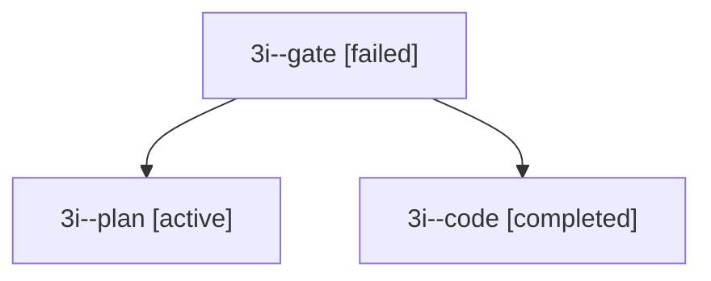

# Session: 3i

[Agent Hoods](../README.md) / [bbugyi200](../users/bbugyi200/README.md) / [apollo](../users/bbugyi200/machines/apollo/README.md) / [3i](../users/bbugyi200/machines/apollo/hoods/3i/README.md) / 3i

Owner: `bbugyi200.apollo` · Hood: `3i` · Members: 3

## Lineage

The diagram is an optional enhancement; the ordered table below contains the same lineage in accessible text.

| Role | Agent | State | Model / provider | Timing | Commits | Prompt | Chat |
|---|---|---|---|---|---:|---|---|
| gate | 3i--gate | failed | opus / claude | 2026-09-30T16:38:32.942719+00:00 → 2026-09-30T16:38:41.846669+00:00 | 0 | — | [Chat](../agents/bbugyi200.apollo.3i--gate/chat.md) |
| plan | 3i--plan | active | opus / claude | 2026-09-30T16:26:35.541484+00:00 | 0 | [Prompt](../agents/bbugyi200.apollo.3i--plan/prompt.md) | [Chat](../agents/bbugyi200.apollo.3i--plan/chat.md) |
| code | 3i--code | completed | muse-spark-1.3-contributor / muse | 2026-09-30T16:38:48.275821+00:00 → 2026-09-30T16:47:56.303778+00:00 | [1](../agents/bbugyi200.apollo.3i--code/README.md#commits) | — | [Chat](../agents/bbugyi200.apollo.3i--code/chat.md) |

## Commits

| Role | Repo | Commit | Subject | Committed |
|---|---|---|---|---|
| code | bob-cli | [`f04377a`](https://github.com/bobs-org/bob-cli/commit/f04377a01c73a0e30cfd2cbe96e4956e67ba00e6) | feat(memory): launch decisions web with three accepted records | 2026-09-30 12:47:15 EDT |

## Neighbors

| Agent | Relation | State |
|---|---|---|
| [3i.cld](../agents/bbugyi200.apollo.3i.cld/README.md) | descendant | completed |
