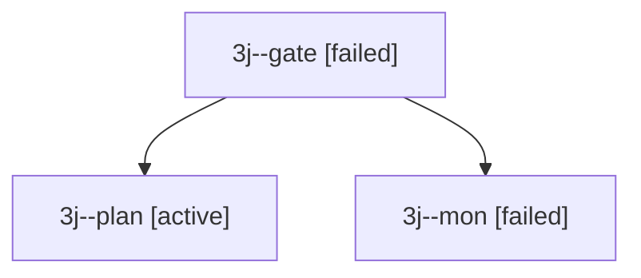

# Session: 3j

[Agent Hoods](../README.md) / [bbugyi200](../users/bbugyi200/README.md) / [apollo](../users/bbugyi200/machines/apollo/README.md) / [3j](../users/bbugyi200/machines/apollo/hoods/3j/README.md) / 3j

Owner: `bbugyi200.apollo` · Hood: `3j` · Members: 3

## Lineage

The diagram is an optional enhancement; the ordered table below contains the same lineage in accessible text.

| Role | Agent | State | Model / provider | Timing | Commits | Prompt | Chat |
|---|---|---|---|---|---:|---|---|
| gate | 3j--gate | failed | opus / claude | 2026-09-30T17:00:02.014964+00:00 → 2026-09-30T17:00:08.658624+00:00 | 0 | — | [Chat](../agents/bbugyi200.apollo.3j--gate/chat.md) |
| plan | 3j--plan | active | opus / claude | 2026-09-30T16:38:24.090677+00:00 | 0 | [Prompt](../agents/bbugyi200.apollo.3j--plan/prompt.md) | [Chat](../agents/bbugyi200.apollo.3j--plan/chat.md) |
| mon | 3j--mon | failed | opus / claude | 2026-09-30T17:00:07.665188+00:00 → 2026-09-30T17:00:47.908636+00:00 | 0 | — | [Chat](../agents/bbugyi200.apollo.3j--mon/chat.md) |

## Neighbors

| Agent | Relation | State |
|---|---|---|
| [3j.f1.r1](../agents/bbugyi200.apollo.3j.f1.r1/README.md) | descendant | completed |
| [3j.f1.r1.f1.r1](../agents/bbugyi200.apollo.3j.f1.r1.f1.r1/README.md) | descendant | completed |
