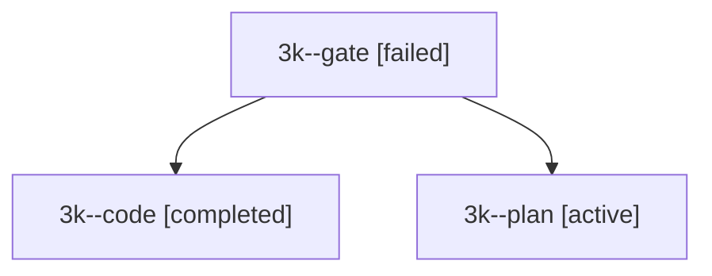

# Session: 3k

[Agent Hoods](../README.md) / [bbugyi200](../users/bbugyi200/README.md) / [apollo](../users/bbugyi200/machines/apollo/README.md) / [3k](../users/bbugyi200/machines/apollo/hoods/3k/README.md) / 3k

Owner: `bbugyi200.apollo` · Hood: `3k` · Members: 3

## Lineage

The diagram is an optional enhancement; the ordered table below contains the same lineage in accessible text.

| Role | Agent | State | Model / provider | Timing | Commits | Prompt | Chat |
|---|---|---|---|---|---:|---|---|
| gate | 3k--gate | failed | opus / claude | 2026-09-30T19:32:51.084185+00:00 → 2026-09-30T19:33:00.325152+00:00 | 0 | — | [Chat](../agents/bbugyi200.apollo.3k--gate/chat.md) |
| code | 3k--code | completed | muse-spark-1.3-contributor / muse | 2026-09-30T19:33:06.588911+00:00 → 2026-09-30T20:17:07.597692+00:00 | 0 | — | [Chat](../agents/bbugyi200.apollo.3k--code/chat.md) |
| plan | 3k--plan | active | opus / claude | 2026-09-30T19:19:54.231465+00:00 | 0 | [Prompt](../agents/bbugyi200.apollo.3k--plan/prompt.md) | [Chat](../agents/bbugyi200.apollo.3k--plan/chat.md) |
