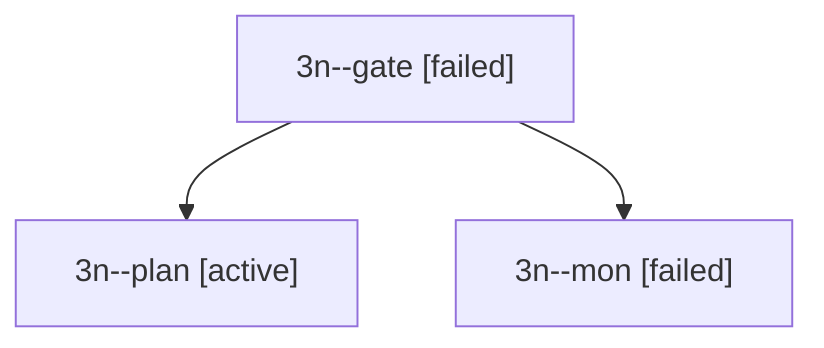

# Session: 3n

[Agent Hoods](../README.md) / [bbugyi200](../users/bbugyi200/README.md) / [apollo](../users/bbugyi200/machines/apollo/README.md) / [3n](../users/bbugyi200/machines/apollo/hoods/3n/README.md) / 3n

Owner: `bbugyi200.apollo` · Hood: `3n` · Members: 3

## Lineage

The diagram is an optional enhancement; the ordered table below contains the same lineage in accessible text.

| Role | Agent | State | Model / provider | Timing | Commits | Prompt | Chat |
|---|---|---|---|---|---:|---|---|
| gate | 3n--gate | failed | opus / claude | 2026-09-30T20:41:46.830495+00:00 → 2026-09-30T20:41:53.623438+00:00 | 0 | — | [Chat](../agents/bbugyi200.apollo.3n--gate/chat.md) |
| plan | 3n--plan | active | opus / claude | 2026-09-30T20:16:43.977189+00:00 | 0 | [Prompt](../agents/bbugyi200.apollo.3n--plan/prompt.md) | [Chat](../agents/bbugyi200.apollo.3n--plan/chat.md) |
| mon | 3n--mon | failed | opus / claude | 2026-09-30T20:41:52.698294+00:00 → 2026-09-30T20:42:34.168401+00:00 | 0 | — | [Chat](../agents/bbugyi200.apollo.3n--mon/chat.md) |

## Commits

| Role | Repo | Commit | Subject | Committed |
|---|---|---|---|---|
| — | bob-cli | [`01c5ce5`](https://github.com/bobs-org/bob-cli/commit/01c5ce537defae467e0ff8f96b04199dcbba62ea) | chore: Add SDD prompt and plan for obsidian\_nav\_create\_missing\_notes | 2026-06-07 09:36:41 EDT |
