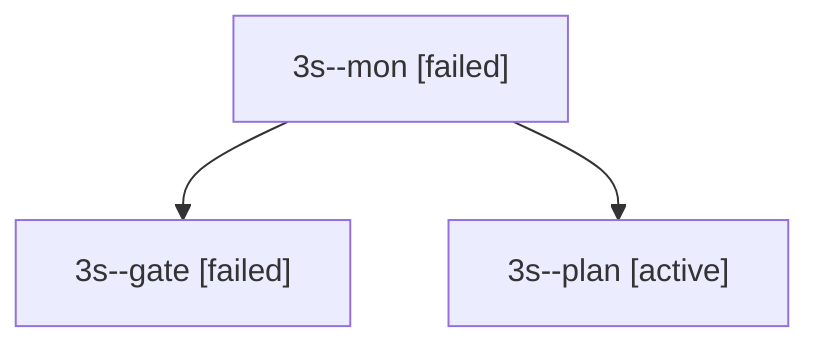

# Session: 3s

[Agent Hoods](../README.md) / [bbugyi200](../users/bbugyi200/README.md) / [apollo](../users/bbugyi200/machines/apollo/README.md) / [3s](../users/bbugyi200/machines/apollo/hoods/3s/README.md) / 3s

Owner: `bbugyi200.apollo` · Hood: `3s` · Members: 3

## Lineage

The diagram is an optional enhancement; the ordered table below contains the same lineage in accessible text.

| Role | Agent | State | Model / provider | Timing | Commits | Prompt | Chat |
|---|---|---|---|---|---:|---|---|
| mon | 3s--mon | failed | opus / claude | 2026-10-01T06:06:57.133204+00:00 → 2026-10-01T06:07:43.473124+00:00 | 0 | — | [Chat](../agents/bbugyi200.apollo.3s--mon/chat.md) |
| gate | 3s--gate | failed | opus / claude | 2026-10-01T06:06:49.351987+00:00 → 2026-10-01T06:06:58.003288+00:00 | 0 | — | [Chat](../agents/bbugyi200.apollo.3s--gate/chat.md) |
| plan | 3s--plan | active | opus / claude | 2026-10-01T05:47:32.318102+00:00 | 0 | [Prompt](../agents/bbugyi200.apollo.3s--plan/prompt.md) | [Chat](../agents/bbugyi200.apollo.3s--plan/chat.md) |
