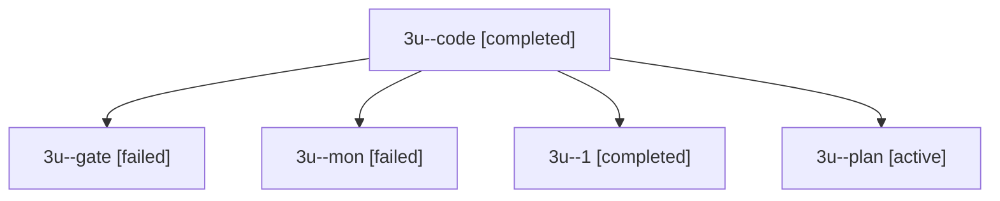

# Session: 3u

[Agent Hoods](../README.md) / [bbugyi200](../users/bbugyi200/README.md) / [apollo](../users/bbugyi200/machines/apollo/README.md) / [3u](../users/bbugyi200/machines/apollo/hoods/3u/README.md) / 3u

Owner: `bbugyi200.apollo` · Hood: `3u` · Members: 5

## Lineage

The diagram is an optional enhancement; the ordered table below contains the same lineage in accessible text.

| Role | Agent | State | Model / provider | Timing | Commits | Prompt | Chat |
|---|---|---|---|---|---:|---|---|
| code | 3u--code | completed | muse-spark-1.3-contributor / muse | 2026-10-01T13:41:40.128720+00:00 → 2026-10-01T13:44:37.537283+00:00 | 0 | — | [Chat](../agents/bbugyi200.apollo.3u--code/chat.md) |
| gate | 3u--gate | failed | opus / claude | 2026-10-01T13:41:18.496686+00:00 → 2026-10-01T13:41:31.510346+00:00 | 0 | — | [Chat](../agents/bbugyi200.apollo.3u--gate/chat.md) |
| mon | 3u--mon | failed | muse-spark-1.3-contributor / muse | 2026-10-01T13:43:52.181541+00:00 → 2026-10-01T13:49:02.460109+00:00 | 0 | — | [Chat](../agents/bbugyi200.apollo.3u--mon/chat.md) |
| 1 | 3u--1 | completed | muse-spark-1.3-contributor / muse | 2026-10-01T13:49:02.294518+00:00 → 2026-10-01T13:52:18.616670+00:00 | 0 | [Prompt](../agents/bbugyi200.apollo.3u--1/prompt.md) | [Chat](../agents/bbugyi200.apollo.3u--1/chat.md) |
| plan | 3u--plan | active | opus / claude | 2026-10-01T13:34:50.285480+00:00 | 0 | [Prompt](../agents/bbugyi200.apollo.3u--plan/prompt.md) | [Chat](../agents/bbugyi200.apollo.3u--plan/chat.md) |
