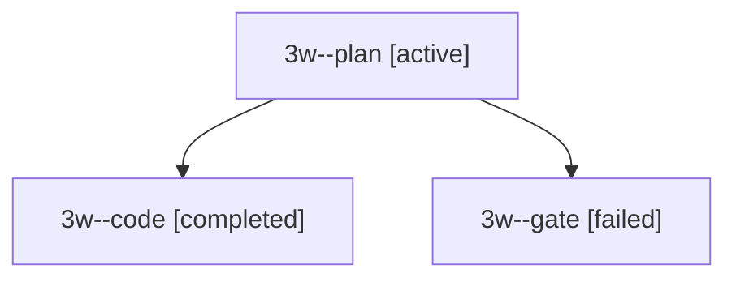

# Session: 3w

[Agent Hoods](../README.md) / [bbugyi200](../users/bbugyi200/README.md) / [apollo](../users/bbugyi200/machines/apollo/README.md) / [3w](../users/bbugyi200/machines/apollo/hoods/3w/README.md) / 3w

Owner: `bbugyi200.apollo` · Hood: `3w` · Members: 3

## Lineage

The diagram is an optional enhancement; the ordered table below contains the same lineage in accessible text.

| Role | Agent | State | Model / provider | Timing | Commits | Prompt | Chat |
|---|---|---|---|---|---:|---|---|
| plan | 3w--plan | active | grok-4.7 / grok | 2026-10-01T14:18:32.330157+00:00 | 0 | [Prompt](../agents/bbugyi200.apollo.3w--plan/prompt.md) | [Chat](../agents/bbugyi200.apollo.3w--plan/chat.md) |
| code | 3w--code | completed | muse-spark-1.3-contributor / muse | 2026-10-01T14:26:51.440990+00:00 → 2026-10-01T14:44:36.914132+00:00 | [1](../agents/bbugyi200.apollo.3w--code/README.md#commits) | — | [Chat](../agents/bbugyi200.apollo.3w--code/chat.md) |
| gate | 3w--gate | failed | grok-4.7 / grok | 2026-10-01T14:26:34.953135+00:00 → 2026-10-01T14:26:44.351652+00:00 | 0 | — | [Chat](../agents/bbugyi200.apollo.3w--gate/chat.md) |

## Commits

| Role | Repo | Commit | Subject | Committed |
|---|---|---|---|---|
| code | bob-cli | [`c857c30`](https://github.com/bobs-org/bob-cli/commit/c857c309787a15e507cdcfa367b93a35db294020) | docs(plan): daily bob-plan block and dash TODAY chip describe the renamed theme/link budget | 2026-10-01 10:43:05 EDT |
