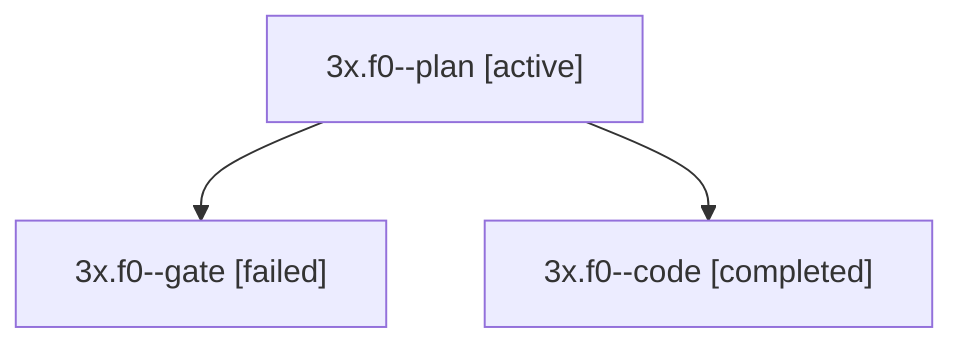

# Session: 3x.f0

[Agent Hoods](../README.md) / [bbugyi200](../users/bbugyi200/README.md) / [apollo](../users/bbugyi200/machines/apollo/README.md) / [3x](../users/bbugyi200/machines/apollo/hoods/3x/README.md) / 3x.f0

Owner: `bbugyi200.apollo` · Hood: `3x` · Members: 3

## Lineage

The diagram is an optional enhancement; the ordered table below contains the same lineage in accessible text.

| Role | Agent | State | Model / provider | Timing | Commits | Prompt | Chat |
|---|---|---|---|---|---:|---|---|
| plan | 3x.f0--plan | active | opus / claude | 2026-10-01T18:19:50.637422+00:00 | 0 | [Prompt](../agents/bbugyi200.apollo.3x.f0--plan/prompt.md) | [Chat](../agents/bbugyi200.apollo.3x.f0--plan/chat.md) |
| gate | 3x.f0--gate | failed | opus / claude | 2026-10-01T18:29:30.056792+00:00 → 2026-10-01T18:29:39.459538+00:00 | 0 | — | [Chat](../agents/bbugyi200.apollo.3x.f0--gate/chat.md) |
| code | 3x.f0--code | completed | muse-spark-1.3-contributor / muse | 2026-10-01T18:29:45.901015+00:00 → 2026-10-01T18:37:59.155628+00:00 | [1](../agents/bbugyi200.apollo.3x.f0--code/README.md#commits) | — | [Chat](../agents/bbugyi200.apollo.3x.f0--code/chat.md) |

## Commits

| Role | Repo | Commit | Subject | Committed |
|---|---|---|---|---|
| code | bob-cli | [`cd7a8cf`](https://github.com/bobs-org/bob-cli/commit/cd7a8cf9397dcf71b9f0f298ecb1aff1fbb332fd) | docs(plan): document the plugin-only ready\_cap\_exceeded lint | 2026-10-01 14:36:50 EDT |

## Neighbors

| Agent | Relation | State |
|---|---|---|
| [3x](bbugyi200.apollo.3x.md) (session · 3) | ancestor | active 1, completed 1, failed 1 |
