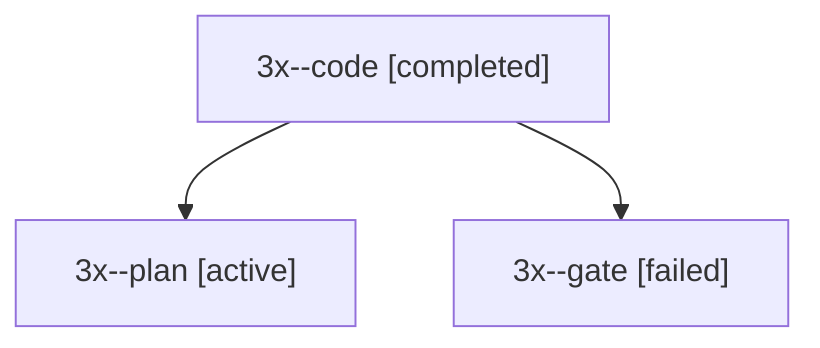

# Session: 3x

[Agent Hoods](../README.md) / [bbugyi200](../users/bbugyi200/README.md) / [apollo](../users/bbugyi200/machines/apollo/README.md) / [3x](../users/bbugyi200/machines/apollo/hoods/3x/README.md) / 3x

Owner: `bbugyi200.apollo` · Hood: `3x` · Members: 3

## Lineage

The diagram is an optional enhancement; the ordered table below contains the same lineage in accessible text.

| Role | Agent | State | Model / provider | Timing | Commits | Prompt | Chat |
|---|---|---|---|---|---:|---|---|
| code | 3x--code | completed | muse-spark-1.3-contributor / muse | 2026-10-01T14:58:10.753413+00:00 → 2026-10-01T15:05:27.355857+00:00 | 0 | — | [Chat](../agents/bbugyi200.apollo.3x--code/chat.md) |
| plan | 3x--plan | active | gpt-6.1-sol / codex | 2026-10-01T14:50:44.209629+00:00 | 0 | [Prompt](../agents/bbugyi200.apollo.3x--plan/prompt.md) | [Chat](../agents/bbugyi200.apollo.3x--plan/chat.md) |
| gate | 3x--gate | failed | gpt-6.1-sol / codex | 2026-10-01T14:57:50.367455+00:00 → 2026-10-01T14:58:04.636644+00:00 | 0 | — | [Chat](../agents/bbugyi200.apollo.3x--gate/chat.md) |

## Neighbors

| Agent | Relation | State |
|---|---|---|
| [3x.f0](bbugyi200.apollo.3x.f0.md) (session · 3) | descendant | active 1, completed 1, failed 1 |
