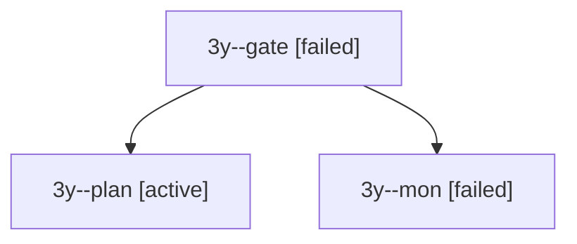

# Session: 3y

[Agent Hoods](../README.md) / [bbugyi200](../users/bbugyi200/README.md) / [apollo](../users/bbugyi200/machines/apollo/README.md) / [3y](../users/bbugyi200/machines/apollo/hoods/3y/README.md) / 3y

Owner: `bbugyi200.apollo` · Hood: `3y` · Members: 3

## Lineage

The diagram is an optional enhancement; the ordered table below contains the same lineage in accessible text.

| Role | Agent | State | Model / provider | Timing | Commits | Prompt | Chat |
|---|---|---|---|---|---:|---|---|
| gate | 3y--gate | failed | opus / claude | 2026-10-01T15:19:25.312409+00:00 → 2026-10-01T15:19:33.361517+00:00 | 0 | — | [Chat](../agents/bbugyi200.apollo.3y--gate/chat.md) |
| plan | 3y--plan | active | opus / claude | 2026-10-01T14:57:52.480060+00:00 | 0 | [Prompt](../agents/bbugyi200.apollo.3y--plan/prompt.md) | [Chat](../agents/bbugyi200.apollo.3y--plan/chat.md) |
| mon | 3y--mon | failed | opus / claude | 2026-10-01T15:19:32.610133+00:00 → 2026-10-01T15:20:13.526874+00:00 | 0 | — | [Chat](../agents/bbugyi200.apollo.3y--mon/chat.md) |
