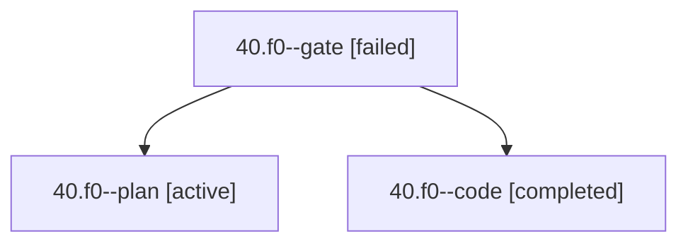

# Session: 40.f0

[Agent Hoods](../README.md) / [bbugyi200](../users/bbugyi200/README.md) / [apollo](../users/bbugyi200/machines/apollo/README.md) / [40](../users/bbugyi200/machines/apollo/hoods/40/README.md) / 40.f0

Owner: `bbugyi200.apollo` · Hood: `40` · Members: 3

## Lineage

The diagram is an optional enhancement; the ordered table below contains the same lineage in accessible text.

| Role | Agent | State | Model / provider | Timing | Commits | Prompt | Chat |
|---|---|---|---|---|---:|---|---|
| gate | 40.f0--gate | failed | opus / claude | 2026-10-01T20:09:51.973166+00:00 → 2026-10-01T20:10:00.975849+00:00 | 0 | — | [Chat](../agents/bbugyi200.apollo.40.f0--gate/chat.md) |
| plan | 40.f0--plan | active | opus / claude | 2026-10-01T20:02:37.492905+00:00 | 0 | [Prompt](../agents/bbugyi200.apollo.40.f0--plan/prompt.md) | [Chat](../agents/bbugyi200.apollo.40.f0--plan/chat.md) |
| code | 40.f0--code | completed | muse-spark-1.3-contributor / muse | 2026-10-01T20:10:07.856093+00:00 → 2026-10-01T20:36:50.909954+00:00 | [1](../agents/bbugyi200.apollo.40.f0--code/README.md#commits) | — | [Chat](../agents/bbugyi200.apollo.40.f0--code/chat.md) |

## Commits

| Role | Repo | Commit | Subject | Committed |
|---|---|---|---|---|
| code | bob-cli | [`5d24c98`](https://github.com/bobs-org/bob-cli/commit/5d24c98857b1d16dd1d4161da72272f272ad92bc) | fix(tasks): reject native-only status.symbol in user Tasks queries | 2026-10-01 16:35:37 EDT |

## Neighbors

| Agent | Relation | State |
|---|---|---|
| [40](bbugyi200.apollo.40.md) (session · 3) | ancestor | active 1, completed 1, failed 1 |
