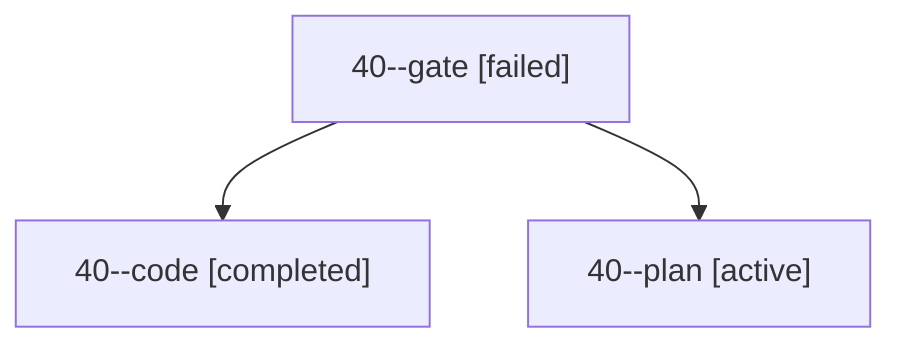

# Session: 40

[Agent Hoods](../README.md) / [bbugyi200](../users/bbugyi200/README.md) / [apollo](../users/bbugyi200/machines/apollo/README.md) / [40](../users/bbugyi200/machines/apollo/hoods/40/README.md) / 40

Owner: `bbugyi200.apollo` · Hood: `40` · Members: 3

## Lineage

The diagram is an optional enhancement; the ordered table below contains the same lineage in accessible text.

| Role | Agent | State | Model / provider | Timing | Commits | Prompt | Chat |
|---|---|---|---|---|---:|---|---|
| gate | 40--gate | failed | gpt-6-astra / codex | 2026-10-01T19:38:40.410581+00:00 → 2026-10-01T19:38:50.618786+00:00 | 0 | — | [Chat](../agents/bbugyi200.apollo.40--gate/chat.md) |
| code | 40--code | completed | muse-spark-1.3-contributor / muse | 2026-10-01T19:38:57.270179+00:00 → 2026-10-01T19:57:52.564813+00:00 | [1](../agents/bbugyi200.apollo.40--code/README.md#commits) | — | [Chat](../agents/bbugyi200.apollo.40--code/chat.md) |
| plan | 40--plan | active | gpt-6-astra / codex | 2026-10-01T19:24:38.080537+00:00 | 0 | [Prompt](../agents/bbugyi200.apollo.40--plan/prompt.md) | [Chat](../agents/bbugyi200.apollo.40--plan/chat.md) |

## Commits

| Role | Repo | Commit | Subject | Committed |
|---|---|---|---|---|
| code | bob-cli | [`eba9cbc`](https://github.com/bobs-org/bob-cli/commit/eba9cbc940393a2c733c68a0ed198ec08b3f84b2) | docs(plan): dashboard section counts vs whole-lane budgets and hide/path parity | 2026-10-01 15:56:28 EDT |

## Neighbors

| Agent | Relation | State |
|---|---|---|
| [40.f0](bbugyi200.apollo.40.f0.md) (session · 3) | descendant | active 1, completed 1, failed 1 |
