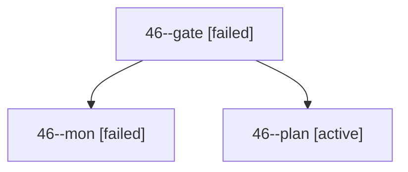

# Session: 46

[Agent Hoods](../README.md) / [bbugyi200](../users/bbugyi200/README.md) / [apollo](../users/bbugyi200/machines/apollo/README.md) / [46](../users/bbugyi200/machines/apollo/hoods/46/README.md) / 46

Owner: `bbugyi200.apollo` · Hood: `46` · Members: 3

## Lineage

The diagram is an optional enhancement; the ordered table below contains the same lineage in accessible text.

| Role | Agent | State | Model / provider | Timing | Commits | Prompt | Chat |
|---|---|---|---|---|---:|---|---|
| gate | 46--gate | failed | opus / claude | 2026-10-02T15:06:01.669630+00:00 → 2026-10-02T15:06:09.749857+00:00 | 0 | — | [Chat](../agents/bbugyi200.apollo.46--gate/chat.md) |
| mon | 46--mon | failed | opus / claude | 2026-10-02T15:06:09.016650+00:00 → 2026-10-02T15:06:51.625605+00:00 | 0 | — | [Chat](../agents/bbugyi200.apollo.46--mon/chat.md) |
| plan | 46--plan | active | opus / claude | 2026-10-02T14:50:34.149238+00:00 | 0 | [Prompt](../agents/bbugyi200.apollo.46--plan/prompt.md) | [Chat](../agents/bbugyi200.apollo.46--plan/chat.md) |
