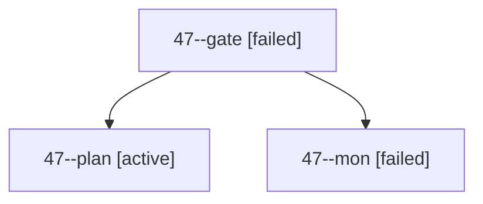

# Session: 47

[Agent Hoods](../README.md) / [bbugyi200](../users/bbugyi200/README.md) / [apollo](../users/bbugyi200/machines/apollo/README.md) / [47](../users/bbugyi200/machines/apollo/hoods/47/README.md) / 47

Owner: `bbugyi200.apollo` · Hood: `47` · Members: 3

## Lineage

The diagram is an optional enhancement; the ordered table below contains the same lineage in accessible text.

| Role | Agent | State | Model / provider | Timing | Commits | Prompt | Chat |
|---|---|---|---|---|---:|---|---|
| gate | 47--gate | failed | opus / claude | 2026-10-02T19:17:37.267656+00:00 → 2026-10-02T19:17:44.263500+00:00 | 0 | — | [Chat](../agents/bbugyi200.apollo.47--gate/chat.md) |
| plan | 47--plan | active | opus / claude | 2026-10-02T18:59:15.734734+00:00 | 0 | [Prompt](../agents/bbugyi200.apollo.47--plan/prompt.md) | [Chat](../agents/bbugyi200.apollo.47--plan/chat.md) |
| mon | 47--mon | failed | opus / claude | 2026-10-02T19:17:43.669394+00:00 → 2026-10-02T19:18:21.025149+00:00 | 0 | — | [Chat](../agents/bbugyi200.apollo.47--mon/chat.md) |
