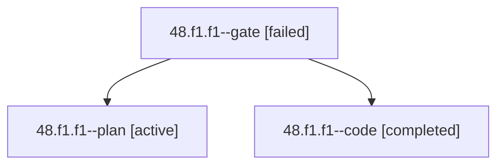

# Session: 48.f1.f1

[Agent Hoods](../README.md) / [bbugyi200](../users/bbugyi200/README.md) / [apollo](../users/bbugyi200/machines/apollo/README.md) / [48](../users/bbugyi200/machines/apollo/hoods/48/README.md) / 48.f1.f1

Owner: `bbugyi200.apollo` · Hood: `48` · Members: 3

## Lineage

The diagram is an optional enhancement; the ordered table below contains the same lineage in accessible text.

| Role | Agent | State | Model / provider | Timing | Commits | Prompt | Chat |
|---|---|---|---|---|---:|---|---|
| gate | 48.f1.f1--gate | failed | opus / claude | 2026-10-02T20:25:37.382500+00:00 → 2026-10-02T20:25:45.377735+00:00 | 0 | — | [Chat](../agents/bbugyi200.apollo.48.f1.f1--gate/chat.md) |
| plan | 48.f1.f1--plan | active | opus / claude | 2026-10-02T20:15:28.779522+00:00 | 0 | [Prompt](../agents/bbugyi200.apollo.48.f1.f1--plan/prompt.md) | [Chat](../agents/bbugyi200.apollo.48.f1.f1--plan/chat.md) |
| code | 48.f1.f1--code | completed | muse-spark-1.3-contributor / muse | 2026-10-02T20:25:51.918746+00:00 → 2026-10-02T20:32:36.791215+00:00 | 0 | — | [Chat](../agents/bbugyi200.apollo.48.f1.f1--code/chat.md) |

## Neighbors

| Agent | Relation | State |
|---|---|---|
| [48.f1](bbugyi200.apollo.48.f1.md) (session · 3) | ancestor | active 1, completed 1, failed 1 |
| [48](bbugyi200.apollo.48.md) (session · 3) | ancestor | active 1, completed 1, failed 1 |
| [48.f1.f0](../agents/bbugyi200.apollo.48.f1.f0/README.md) | 48.f1 hood | active |
| [48.f0](../agents/bbugyi200.apollo.48.f0/README.md) | 48 hood | active |
