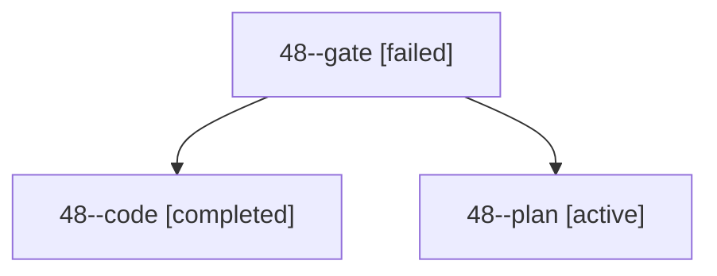

# Session: 48

[Agent Hoods](../README.md) / [bbugyi200](../users/bbugyi200/README.md) / [apollo](../users/bbugyi200/machines/apollo/README.md) / [48](../users/bbugyi200/machines/apollo/hoods/48/README.md) / 48

Owner: `bbugyi200.apollo` · Hood: `48` · Members: 3

## Lineage

The diagram is an optional enhancement; the ordered table below contains the same lineage in accessible text.

| Role | Agent | State | Model / provider | Timing | Commits | Prompt | Chat |
|---|---|---|---|---|---:|---|---|
| gate | 48--gate | failed | opus / claude | 2026-10-02T19:21:33.382199+00:00 → 2026-10-02T19:21:41.799423+00:00 | 0 | — | [Chat](../agents/bbugyi200.apollo.48--gate/chat.md) |
| code | 48--code | completed | muse-spark-1.3-contributor / muse | 2026-10-02T19:21:47.555241+00:00 → 2026-10-02T19:31:00.755940+00:00 | 0 | — | [Chat](../agents/bbugyi200.apollo.48--code/chat.md) |
| plan | 48--plan | active | opus / claude | 2026-10-02T19:15:17.655519+00:00 | 0 | [Prompt](../agents/bbugyi200.apollo.48--plan/prompt.md) | [Chat](../agents/bbugyi200.apollo.48--plan/chat.md) |

## Neighbors

| Agent | Relation | State |
|---|---|---|
| [48.f0](../agents/bbugyi200.apollo.48.f0/README.md) | descendant | active |
| [48.f1](bbugyi200.apollo.48.f1.md) (session · 3) | descendant | active 1, completed 1, failed 1 |
| [48.f1.f0](../agents/bbugyi200.apollo.48.f1.f0/README.md) | descendant | active |
| [48.f1.f1](bbugyi200.apollo.48.f1.f1.md) (session · 3) | descendant | active 1, completed 1, failed 1 |
