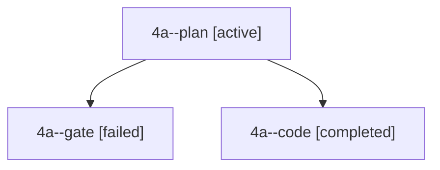

# Session: 4a

[Agent Hoods](../README.md) / [bbugyi200](../users/bbugyi200/README.md) / [apollo](../users/bbugyi200/machines/apollo/README.md) / [4a](../users/bbugyi200/machines/apollo/hoods/4a/README.md) / 4a

Owner: `bbugyi200.apollo` · Hood: `4a` · Members: 3

## Lineage

The diagram is an optional enhancement; the ordered table below contains the same lineage in accessible text.

| Role | Agent | State | Model / provider | Timing | Commits | Prompt | Chat |
|---|---|---|---|---|---:|---|---|
| plan | 4a--plan | active | gpt-6.1-sol / codex | 2026-10-02T20:49:37.459647+00:00 | 0 | [Prompt](../agents/bbugyi200.apollo.4a--plan/prompt.md) | [Chat](../agents/bbugyi200.apollo.4a--plan/chat.md) |
| gate | 4a--gate | failed | gpt-6.1-sol / codex | 2026-10-02T20:55:11.326797+00:00 → 2026-10-02T20:55:20.354127+00:00 | 0 | — | [Chat](../agents/bbugyi200.apollo.4a--gate/chat.md) |
| code | 4a--code | completed | muse-spark-1.3-contributor / muse | 2026-10-02T20:55:25.911103+00:00 → 2026-10-02T21:03:08.472681+00:00 | [1](../agents/bbugyi200.apollo.4a--code/README.md#commits) | — | [Chat](../agents/bbugyi200.apollo.4a--code/chat.md) |

## Commits

| Role | Repo | Commit | Subject | Committed |
|---|---|---|---|---|
| code | bob-cli | [`664e01c`](https://github.com/bobs-org/bob-cli/commit/664e01ce66403e1bb7a268454cbbf7b91e37d063) | docs(projects): document scheduled-first picker row for prioritized tasks | 2026-10-02 17:01:59 EDT |
