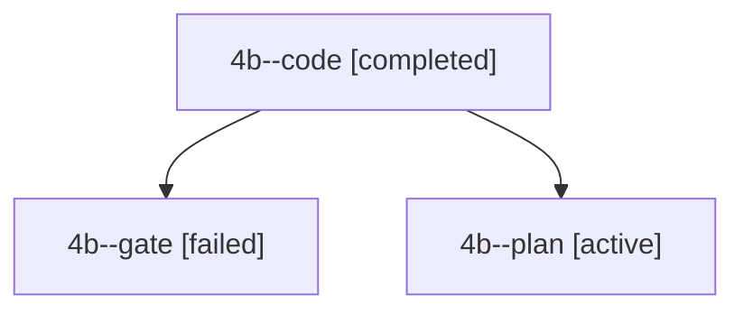

# Session: 4b

[Agent Hoods](../README.md) / [bbugyi200](../users/bbugyi200/README.md) / [apollo](../users/bbugyi200/machines/apollo/README.md) / [4b](../users/bbugyi200/machines/apollo/hoods/4b/README.md) / 4b

Owner: `bbugyi200.apollo` · Hood: `4b` · Members: 3

## Lineage

The diagram is an optional enhancement; the ordered table below contains the same lineage in accessible text.

| Role | Agent | State | Model / provider | Timing | Commits | Prompt | Chat |
|---|---|---|---|---|---:|---|---|
| code | 4b--code | completed | muse-spark-1.3-contributor / muse | 2026-10-02T21:02:39.443493+00:00 → 2026-10-02T21:08:53.411670+00:00 | 0 | — | [Chat](../agents/bbugyi200.apollo.4b--code/chat.md) |
| gate | 4b--gate | failed | grok-4.7 / grok | 2026-10-02T21:02:25.557617+00:00 → 2026-10-02T21:02:33.670533+00:00 | 0 | — | [Chat](../agents/bbugyi200.apollo.4b--gate/chat.md) |
| plan | 4b--plan | active | grok-4.7 / grok | 2026-10-02T20:54:13.672986+00:00 | 0 | [Prompt](../agents/bbugyi200.apollo.4b--plan/prompt.md) | [Chat](../agents/bbugyi200.apollo.4b--plan/chat.md) |
