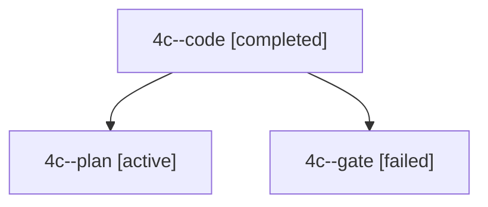

# Session: 4c

[Agent Hoods](../README.md) / [bbugyi200](../users/bbugyi200/README.md) / [apollo](../users/bbugyi200/machines/apollo/README.md) / [4c](../users/bbugyi200/machines/apollo/hoods/4c/README.md) / 4c

Owner: `bbugyi200.apollo` · Hood: `4c` · Members: 3

## Lineage

The diagram is an optional enhancement; the ordered table below contains the same lineage in accessible text.

| Role | Agent | State | Model / provider | Timing | Commits | Prompt | Chat |
|---|---|---|---|---|---:|---|---|
| code | 4c--code | completed | muse-spark-1.3-contributor / muse | 2026-10-02T22:27:49.379152+00:00 → 2026-10-02T23:02:55.133425+00:00 | [1](../agents/bbugyi200.apollo.4c--code/README.md#commits) | — | [Chat](../agents/bbugyi200.apollo.4c--code/chat.md) |
| plan | 4c--plan | active | gpt-6.1-sol / codex | 2026-10-02T22:21:13.797536+00:00 | 0 | [Prompt](../agents/bbugyi200.apollo.4c--plan/prompt.md) | [Chat](../agents/bbugyi200.apollo.4c--plan/chat.md) |
| gate | 4c--gate | failed | gpt-6.1-sol / codex | 2026-10-02T22:27:35.490035+00:00 → 2026-10-02T22:27:43.584301+00:00 | 0 | — | [Chat](../agents/bbugyi200.apollo.4c--gate/chat.md) |

## Commits

| Role | Repo | Commit | Subject | Committed |
|---|---|---|---|---|
| code | bob-cli | [`21ebf8e`](https://github.com/bobs-org/bob-cli/commit/21ebf8e75d4ca9bbcc5d87baf139acdfd52f7b4c) | docs(projects): document scheduling Work Log prompt for Pending/Next tasks | 2026-10-02 19:01:42 EDT |

## Neighbors

| Agent | Relation | State |
|---|---|---|
| [4c.f0](../agents/bbugyi200.apollo.4c.f0/README.md) | descendant | active |
