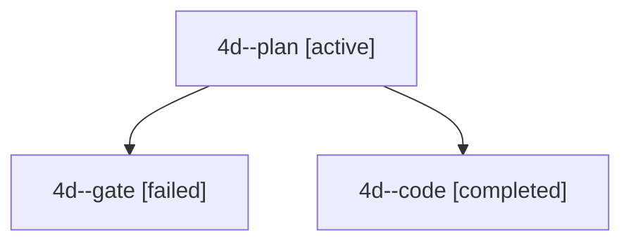

# Session: 4d

[Agent Hoods](../README.md) / [bbugyi200](../users/bbugyi200/README.md) / [apollo](../users/bbugyi200/machines/apollo/README.md) / [4d](../users/bbugyi200/machines/apollo/hoods/4d/README.md) / 4d

Owner: `bbugyi200.apollo` · Hood: `4d` · Members: 3

## Lineage

The diagram is an optional enhancement; the ordered table below contains the same lineage in accessible text.

| Role | Agent | State | Model / provider | Timing | Commits | Prompt | Chat |
|---|---|---|---|---|---:|---|---|
| plan | 4d--plan | active | gpt-6.1-sol / codex | 2026-10-03T10:59:29.543666+00:00 | 0 | [Prompt](../agents/bbugyi200.apollo.4d--plan/prompt.md) | [Chat](../agents/bbugyi200.apollo.4d--plan/chat.md) |
| gate | 4d--gate | failed | gpt-6.1-sol / codex | 2026-10-03T11:04:03.907658+00:00 → 2026-10-03T11:04:12.553716+00:00 | 0 | — | [Chat](../agents/bbugyi200.apollo.4d--gate/chat.md) |
| code | 4d--code | completed | muse-spark-1.3-contributor / muse | 2026-10-03T11:04:18.744138+00:00 → 2026-10-03T11:10:15.546659+00:00 | 0 | — | [Chat](../agents/bbugyi200.apollo.4d--code/chat.md) |
