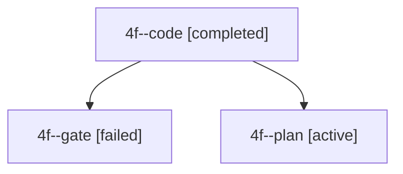

# Session: 4f

[Agent Hoods](../README.md) / [bbugyi200](../users/bbugyi200/README.md) / [apollo](../users/bbugyi200/machines/apollo/README.md) / [4f](../users/bbugyi200/machines/apollo/hoods/4f/README.md) / 4f

Owner: `bbugyi200.apollo` · Hood: `4f` · Members: 3

## Lineage

The diagram is an optional enhancement; the ordered table below contains the same lineage in accessible text.

| Role | Agent | State | Model / provider | Timing | Commits | Prompt | Chat |
|---|---|---|---|---|---:|---|---|
| code | 4f--code | completed | muse-spark-1.3-contributor / muse | 2026-10-03T11:28:06.063061+00:00 → 2026-10-03T11:32:04.605377+00:00 | 0 | — | [Chat](../agents/bbugyi200.apollo.4f--code/chat.md) |
| gate | 4f--gate | failed | gpt-6-astra / codex | 2026-10-03T11:27:51.925256+00:00 → 2026-10-03T11:28:00.191522+00:00 | 0 | — | [Chat](../agents/bbugyi200.apollo.4f--gate/chat.md) |
| plan | 4f--plan | active | gpt-6-astra / codex | 2026-10-03T11:17:49.272031+00:00 | 0 | [Prompt](../agents/bbugyi200.apollo.4f--plan/prompt.md) | [Chat](../agents/bbugyi200.apollo.4f--plan/chat.md) |
