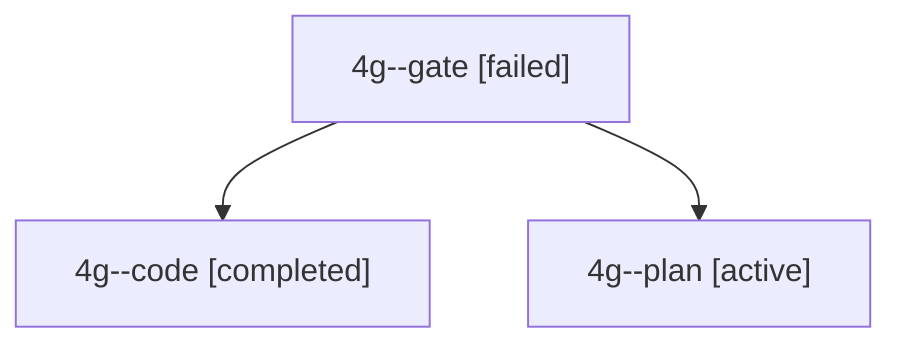

# Session: 4g

[Agent Hoods](../README.md) / [bbugyi200](../users/bbugyi200/README.md) / [apollo](../users/bbugyi200/machines/apollo/README.md) / [4g](../users/bbugyi200/machines/apollo/hoods/4g/README.md) / 4g

Owner: `bbugyi200.apollo` · Hood: `4g` · Members: 3

## Lineage

The diagram is an optional enhancement; the ordered table below contains the same lineage in accessible text.

| Role | Agent | State | Model / provider | Timing | Commits | Prompt | Chat |
|---|---|---|---|---|---:|---|---|
| gate | 4g--gate | failed | gpt-6-astra / codex | 2026-10-03T11:42:57.946877+00:00 → 2026-10-03T11:43:06.272588+00:00 | 0 | — | [Chat](../agents/bbugyi200.apollo.4g--gate/chat.md) |
| code | 4g--code | completed | muse-spark-1.3-contributor / muse | 2026-10-03T11:43:12.249572+00:00 → 2026-10-03T11:56:16.532929+00:00 | [1](../agents/bbugyi200.apollo.4g--code/README.md#commits) | — | [Chat](../agents/bbugyi200.apollo.4g--code/chat.md) |
| plan | 4g--plan | active | gpt-6-astra / codex | 2026-10-03T11:31:57.974239+00:00 | 0 | [Prompt](../agents/bbugyi200.apollo.4g--plan/prompt.md) | [Chat](../agents/bbugyi200.apollo.4g--plan/chat.md) |

## Commits

| Role | Repo | Commit | Subject | Committed |
|---|---|---|---|---|
| code | bob-cli | [`2b99de6`](https://github.com/bobs-org/bob-cli/commit/2b99de6a1ea7481dcbe6eb8248bb79b45a78127d) | docs(deps): document Warm-empty ready and cancellable chunked fallback | 2026-10-03 07:55:00 EDT |
