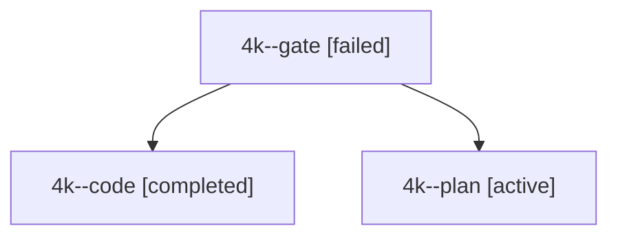

# Session: 4k

[Agent Hoods](../README.md) / [bbugyi200](../users/bbugyi200/README.md) / [apollo](../users/bbugyi200/machines/apollo/README.md) / [4k](../users/bbugyi200/machines/apollo/hoods/4k/README.md) / 4k

Owner: `bbugyi200.apollo` · Hood: `4k` · Members: 3

## Lineage

The diagram is an optional enhancement; the ordered table below contains the same lineage in accessible text.

| Role | Agent | State | Model / provider | Timing | Commits | Prompt | Chat |
|---|---|---|---|---|---:|---|---|
| gate | 4k--gate | failed | gpt-6-astra / codex | 2026-10-03T12:15:23.978192+00:00 → 2026-10-03T12:15:32.187539+00:00 | 0 | — | [Chat](../agents/bbugyi200.apollo.4k--gate/chat.md) |
| code | 4k--code | completed | muse-spark-1.3-contributor / muse | 2026-10-03T12:15:38.135844+00:00 → 2026-10-03T12:26:19.574230+00:00 | 0 | — | [Chat](../agents/bbugyi200.apollo.4k--code/chat.md) |
| plan | 4k--plan | active | gpt-6-astra / codex | 2026-10-03T12:03:31.837539+00:00 | 0 | [Prompt](../agents/bbugyi200.apollo.4k--plan/prompt.md) | [Chat](../agents/bbugyi200.apollo.4k--plan/chat.md) |

## Commits

| Role | Repo | Commit | Subject | Committed |
|---|---|---|---|---|
| — | bob-cli | [`4c51d3b`](https://github.com/bobs-org/bob-cli/commit/4c51d3b20eced08b30e09ff392e29ee39b058bd6) | feat(projects): schedule project task visibility | 2026-07-10 13:28:50 EDT |

## Neighbors

| Agent | Relation | State |
|---|---|---|
| [4k.f-0](../agents/bbugyi200.apollo.4k.f-0/README.md) | descendant | completed |
