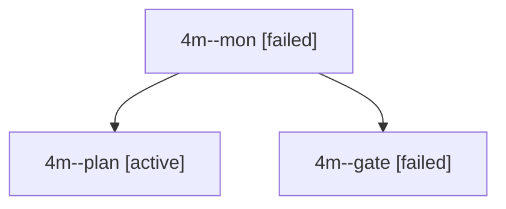

# Session: 4m

[Agent Hoods](../README.md) / [bbugyi200](../users/bbugyi200/README.md) / [apollo](../users/bbugyi200/machines/apollo/README.md) / [4m](../users/bbugyi200/machines/apollo/hoods/4m/README.md) / 4m

Owner: `bbugyi200.apollo` · Hood: `4m` · Members: 3

## Lineage

The diagram is an optional enhancement; the ordered table below contains the same lineage in accessible text.

| Role | Agent | State | Model / provider | Timing | Commits | Prompt | Chat |
|---|---|---|---|---|---:|---|---|
| mon | 4m--mon | failed | gpt-6-astra / codex | 2026-10-03T13:11:49.198909+00:00 → 2026-10-03T13:12:44.519386+00:00 | 0 | — | [Chat](../agents/bbugyi200.apollo.4m--mon/chat.md) |
| plan | 4m--plan | active | gpt-6-astra / codex | 2026-10-03T12:57:35.099815+00:00 | 0 | [Prompt](../agents/bbugyi200.apollo.4m--plan/prompt.md) | [Chat](../agents/bbugyi200.apollo.4m--plan/chat.md) |
| gate | 4m--gate | failed | gpt-6-astra / codex | 2026-10-03T13:11:42.797264+00:00 → 2026-10-03T13:11:49.947045+00:00 | 0 | — | [Chat](../agents/bbugyi200.apollo.4m--gate/chat.md) |
