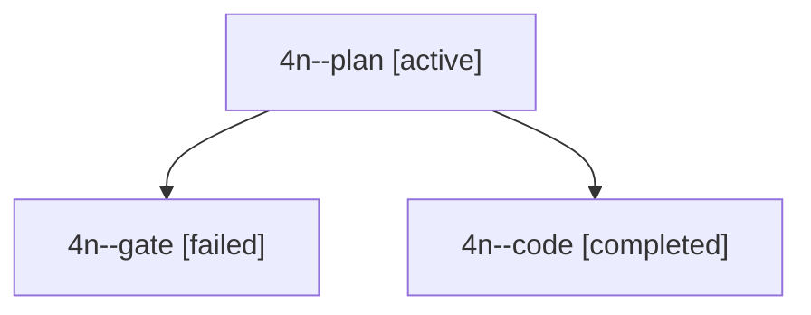

# Session: 4n

[Agent Hoods](../README.md) / [bbugyi200](../users/bbugyi200/README.md) / [apollo](../users/bbugyi200/machines/apollo/README.md) / [4n](../users/bbugyi200/machines/apollo/hoods/4n/README.md) / 4n

Owner: `bbugyi200.apollo` · Hood: `4n` · Members: 3

## Lineage

The diagram is an optional enhancement; the ordered table below contains the same lineage in accessible text.

| Role | Agent | State | Model / provider | Timing | Commits | Prompt | Chat |
|---|---|---|---|---|---:|---|---|
| plan | 4n--plan | active | gpt-6-astra / codex | 2026-10-03T13:04:13.288857+00:00 | 0 | [Prompt](../agents/bbugyi200.apollo.4n--plan/prompt.md) | [Chat](../agents/bbugyi200.apollo.4n--plan/chat.md) |
| gate | 4n--gate | failed | gpt-6-astra / codex | 2026-10-03T13:12:16.397390+00:00 → 2026-10-03T13:12:24.133718+00:00 | 0 | — | [Chat](../agents/bbugyi200.apollo.4n--gate/chat.md) |
| code | 4n--code | completed | muse-spark-1.3-contributor / muse | 2026-10-03T13:12:30.002662+00:00 → 2026-10-03T13:19:43.484706+00:00 | [1](../agents/bbugyi200.apollo.4n--code/README.md#commits) | — | [Chat](../agents/bbugyi200.apollo.4n--code/chat.md) |

## Commits

| Role | Repo | Commit | Subject | Committed |
|---|---|---|---|---|
| code | bob-cli | [`6b64231`](https://github.com/bobs-org/bob-cli/commit/6b6423186314af3a8e7f70a3d61ee7fe0763f856) | docs(freshness): document \[S/\]S first/last review-stack jumps | 2026-10-03 09:17:52 EDT |
