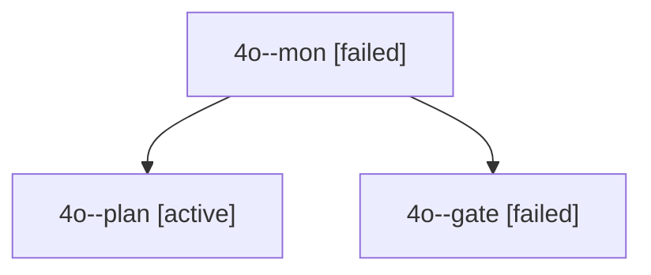

# Session: 4o

[Agent Hoods](../README.md) / [bbugyi200](../users/bbugyi200/README.md) / [apollo](../users/bbugyi200/machines/apollo/README.md) / [4o](../users/bbugyi200/machines/apollo/hoods/4o/README.md) / 4o

Owner: `bbugyi200.apollo` · Hood: `4o` · Members: 3

## Lineage

The diagram is an optional enhancement; the ordered table below contains the same lineage in accessible text.

| Role | Agent | State | Model / provider | Timing | Commits | Prompt | Chat |
|---|---|---|---|---|---:|---|---|
| mon | 4o--mon | failed | gpt-6-astra / codex | 2026-10-03T14:36:53.577474+00:00 → 2026-10-03T14:37:39.445032+00:00 | 0 | — | [Chat](../agents/bbugyi200.apollo.4o--mon/chat.md) |
| plan | 4o--plan | active | gpt-6-astra / codex | 2026-10-03T14:23:54.227755+00:00 | 0 | [Prompt](../agents/bbugyi200.apollo.4o--plan/prompt.md) | [Chat](../agents/bbugyi200.apollo.4o--plan/chat.md) |
| gate | 4o--gate | failed | gpt-6-astra / codex | 2026-10-03T14:36:46.308788+00:00 → 2026-10-03T14:36:54.322056+00:00 | 0 | — | [Chat](../agents/bbugyi200.apollo.4o--gate/chat.md) |
