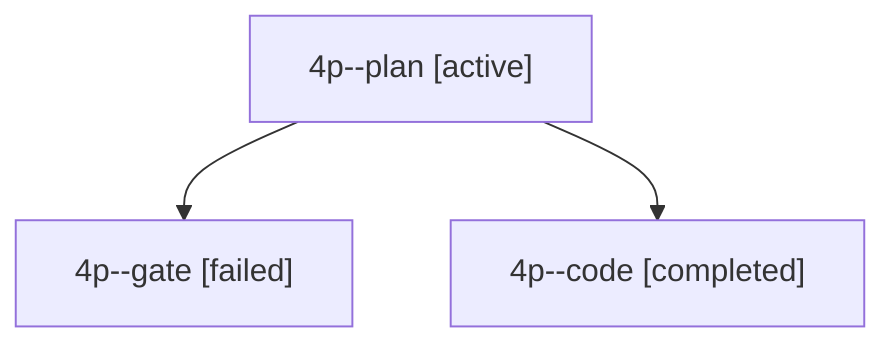

# Session: 4p

[Agent Hoods](../README.md) / [bbugyi200](../users/bbugyi200/README.md) / [apollo](../users/bbugyi200/machines/apollo/README.md) / [4p](../users/bbugyi200/machines/apollo/hoods/4p/README.md) / 4p

Owner: `bbugyi200.apollo` · Hood: `4p` · Members: 3

## Lineage

The diagram is an optional enhancement; the ordered table below contains the same lineage in accessible text.

| Role | Agent | State | Model / provider | Timing | Commits | Prompt | Chat |
|---|---|---|---|---|---:|---|---|
| plan | 4p--plan | active | gpt-6-astra / codex | 2026-10-03T14:33:19.491618+00:00 | 0 | [Prompt](../agents/bbugyi200.apollo.4p--plan/prompt.md) | [Chat](../agents/bbugyi200.apollo.4p--plan/chat.md) |
| gate | 4p--gate | failed | gpt-6-astra / codex | 2026-10-03T14:41:54.364303+00:00 → 2026-10-03T14:42:03.687919+00:00 | 0 | — | [Chat](../agents/bbugyi200.apollo.4p--gate/chat.md) |
| code | 4p--code | completed | muse-spark-1.3-contributor / muse | 2026-10-03T14:42:11.104801+00:00 → 2026-10-03T14:54:56.804335+00:00 | 0 | — | [Chat](../agents/bbugyi200.apollo.4p--code/chat.md) |
