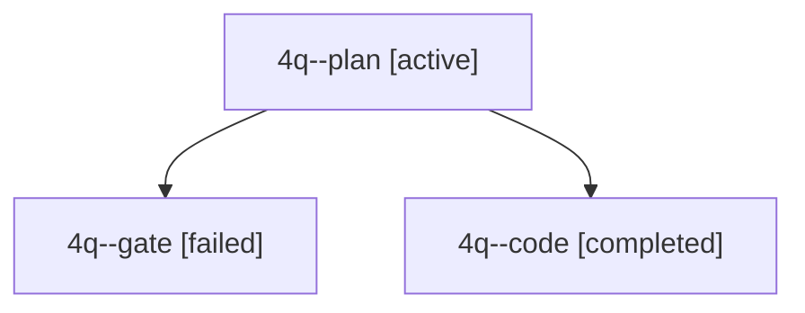

# Session: 4q

[Agent Hoods](../README.md) / [bbugyi200](../users/bbugyi200/README.md) / [apollo](../users/bbugyi200/machines/apollo/README.md) / [4q](../users/bbugyi200/machines/apollo/hoods/4q/README.md) / 4q

Owner: `bbugyi200.apollo` · Hood: `4q` · Members: 3

## Lineage

The diagram is an optional enhancement; the ordered table below contains the same lineage in accessible text.

| Role | Agent | State | Model / provider | Timing | Commits | Prompt | Chat |
|---|---|---|---|---|---:|---|---|
| plan | 4q--plan | active | gpt-6-astra / codex | 2026-10-03T14:47:52.657029+00:00 | 0 | [Prompt](../agents/bbugyi200.apollo.4q--plan/prompt.md) | [Chat](../agents/bbugyi200.apollo.4q--plan/chat.md) |
| gate | 4q--gate | failed | gpt-6-astra / codex | 2026-10-03T14:54:30.536958+00:00 → 2026-10-03T14:54:43.814215+00:00 | 0 | — | [Chat](../agents/bbugyi200.apollo.4q--gate/chat.md) |
| code | 4q--code | completed | muse-spark-1.3-contributor / muse | 2026-10-03T14:54:50.984870+00:00 → 2026-10-03T15:00:08.410822+00:00 | 0 | — | [Chat](../agents/bbugyi200.apollo.4q--code/chat.md) |
