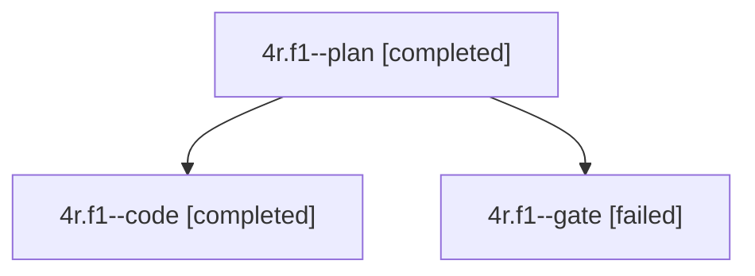

# Session: 4r.f1

[Agent Hoods](../README.md) / [bbugyi200](../users/bbugyi200/README.md) / [apollo](../users/bbugyi200/machines/apollo/README.md) / [4r](../users/bbugyi200/machines/apollo/hoods/4r/README.md) / 4r.f1

Owner: `bbugyi200.apollo` · Hood: `4r` · Members: 3

## Lineage

The diagram is an optional enhancement; the ordered table below contains the same lineage in accessible text.

| Role | Agent | State | Model / provider | Timing | Commits | Prompt | Chat |
|---|---|---|---|---|---:|---|---|
| plan | 4r.f1--plan | completed | gpt-6-astra / codex | 2026-10-03T16:29:34.070643+00:00 → 2026-10-03T17:26:38.008366+00:00 | 0 | [Prompt](../agents/bbugyi200.apollo.4r.f1--plan/prompt.md) | [Chat](../agents/bbugyi200.apollo.4r.f1--plan/chat.md) |
| code | 4r.f1--code | completed | muse-spark-1.3-contributor / muse | 2026-10-03T16:45:08.290444+00:00 → 2026-10-03T17:26:38.008366+00:00 | [1](../agents/bbugyi200.apollo.4r.f1--code/README.md#commits) | — | [Chat](../agents/bbugyi200.apollo.4r.f1--code/chat.md) |
| gate | 4r.f1--gate | failed | gpt-6-astra / codex | 2026-10-03T16:44:51.855211+00:00 → 2026-10-03T16:45:00.917106+00:00 | 0 | — | [Chat](../agents/bbugyi200.apollo.4r.f1--gate/chat.md) |

## Commits

| Role | Repo | Commit | Subject | Committed |
|---|---|---|---|---|
| code | bob-cli | [`129f3b8`](https://github.com/bobs-org/bob-cli/commit/129f3b80611ea36d73950744b140f76e396204d5) | feat(freshness): correct tracker review eligibility, cadence, and schema 6 | 2026-10-03 13:22:04 EDT |

## Neighbors

| Agent | Relation | State |
|---|---|---|
| [4r](bbugyi200.apollo.4r.md) (session · 3) | ancestor | active 1, completed 1, failed 1 |
| [4r.f1.f0](../agents/bbugyi200.apollo.4r.f1.f0/README.md) | descendant | failed |
| [4r.f0](../agents/bbugyi200.apollo.4r.f0/README.md) | 4r hood | active |
