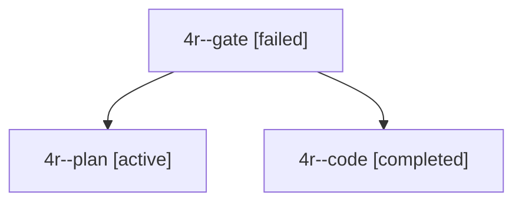

# Session: 4r

[Agent Hoods](../README.md) / [bbugyi200](../users/bbugyi200/README.md) / [apollo](../users/bbugyi200/machines/apollo/README.md) / [4r](../users/bbugyi200/machines/apollo/hoods/4r/README.md) / 4r

Owner: `bbugyi200.apollo` · Hood: `4r` · Members: 3

## Lineage

The diagram is an optional enhancement; the ordered table below contains the same lineage in accessible text.

| Role | Agent | State | Model / provider | Timing | Commits | Prompt | Chat |
|---|---|---|---|---|---:|---|---|
| gate | 4r--gate | failed | gpt-6-astra / codex | 2026-10-03T15:16:15.847421+00:00 → 2026-10-03T15:16:27.287876+00:00 | 0 | — | [Chat](../agents/bbugyi200.apollo.4r--gate/chat.md) |
| plan | 4r--plan | active | gpt-6-astra / codex | 2026-10-03T15:06:47.714212+00:00 | 0 | [Prompt](../agents/bbugyi200.apollo.4r--plan/prompt.md) | [Chat](../agents/bbugyi200.apollo.4r--plan/chat.md) |
| code | 4r--code | completed | muse-spark-1.3-contributor / muse | 2026-10-03T15:16:34.603598+00:00 → 2026-10-03T15:46:51.567950+00:00 | [1](../agents/bbugyi200.apollo.4r--code/README.md#commits) | — | [Chat](../agents/bbugyi200.apollo.4r--code/chat.md) |

## Commits

| Role | Repo | Commit | Subject | Committed |
|---|---|---|---|---|
| — | bob-cli | [`bc829fa`](https://github.com/bobs-org/bob-cli/commit/bc829facebfccc3d7673a41eaf06a37b6c95d3e5) | feat(tasks): sync next tasks from open pomodoros | 2026-07-10 16:17:59 EDT |
| code | bob-cli | [`86f5eaf`](https://github.com/bobs-org/bob-cli/commit/86f5eaf4afd01abb13d89f4fc9657a2b2ed12b21) | feat(freshness): review project and reference tracking tasks in PROJECTS tier | 2026-10-03 11:45:34 EDT |

## Neighbors

| Agent | Relation | State |
|---|---|---|
| [4r.f0](../agents/bbugyi200.apollo.4r.f0/README.md) | descendant | active |
| [4r.f1](bbugyi200.apollo.4r.f1.md) (session · 3) | descendant | completed 2, failed 1 |
| [4r.f1.f0](../agents/bbugyi200.apollo.4r.f1.f0/README.md) | descendant | failed |
