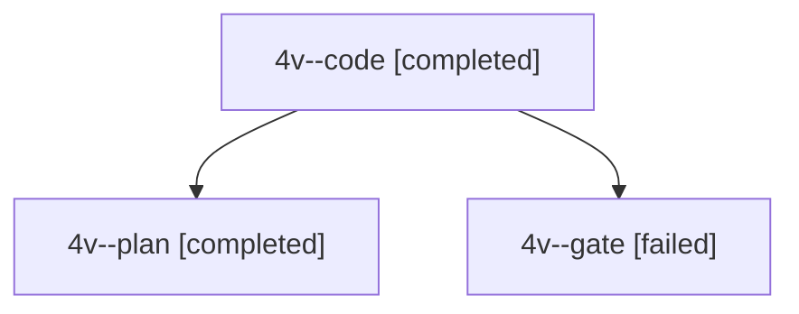

# Session: 4v

[Agent Hoods](../README.md) / [bbugyi200](../users/bbugyi200/README.md) / [apollo](../users/bbugyi200/machines/apollo/README.md) / [4v](../users/bbugyi200/machines/apollo/hoods/4v/README.md) / 4v

Owner: `bbugyi200.apollo` · Hood: `4v` · Members: 3

## Lineage

The diagram is an optional enhancement; the ordered table below contains the same lineage in accessible text.

| Role | Agent | State | Model / provider | Timing | Commits | Prompt | Chat |
|---|---|---|---|---|---:|---|---|
| code | 4v--code | completed | gpt-6-luna / codex | 2026-10-03T20:53:59.814918+00:00 → 2026-10-03T21:21:29.122445+00:00 | [1](../agents/bbugyi200.apollo.4v--code/README.md#commits) | — | [Chat](../agents/bbugyi200.apollo.4v--code/chat.md) |
| plan | 4v--plan | completed | grok-4.7 / grok | 2026-10-03T20:45:47.739996+00:00 → 2026-10-03T21:21:29.122445+00:00 | 0 | [Prompt](../agents/bbugyi200.apollo.4v--plan/prompt.md) | [Chat](../agents/bbugyi200.apollo.4v--plan/chat.md) |
| gate | 4v--gate | failed | grok-4.7 / grok | 2026-10-03T20:53:44.596742+00:00 → 2026-10-03T20:53:53.705187+00:00 | 0 | — | [Chat](../agents/bbugyi200.apollo.4v--gate/chat.md) |

## Commits

| Role | Repo | Commit | Subject | Committed |
|---|---|---|---|---|
| code | bob-cli | [`223974d`](https://github.com/bobs-org/bob-cli/commit/223974dca6d703d11428d363f50f0a78d1e8b5a1) | docs(freshness): document Pending refresh Work Log prompt | 2026-10-03 17:20:17 EDT |
