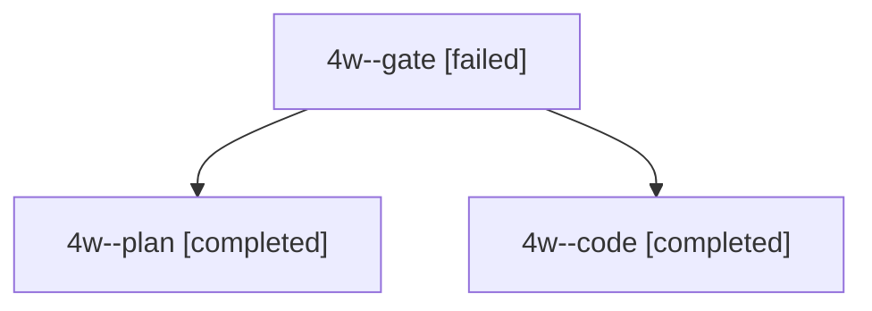

# Session: 4w

[Agent Hoods](../README.md) / [bbugyi200](../users/bbugyi200/README.md) / [apollo](../users/bbugyi200/machines/apollo/README.md) / [4w](../users/bbugyi200/machines/apollo/hoods/4w/README.md) / 4w

Owner: `bbugyi200.apollo` · Hood: `4w` · Members: 3

## Lineage

The diagram is an optional enhancement; the ordered table below contains the same lineage in accessible text.

| Role | Agent | State | Model / provider | Timing | Commits | Prompt | Chat |
|---|---|---|---|---|---:|---|---|
| gate | 4w--gate | failed | gpt-6.1-sol / codex | 2026-10-03T21:38:00.786301+00:00 → 2026-10-03T21:38:09.103774+00:00 | 0 | — | [Chat](../agents/bbugyi200.apollo.4w--gate/chat.md) |
| plan | 4w--plan | completed | gpt-6.1-sol / codex | 2026-10-03T21:30:45.423774+00:00 → 2026-10-03T22:01:07.502883+00:00 | 0 | [Prompt](../agents/bbugyi200.apollo.4w--plan/prompt.md) | [Chat](../agents/bbugyi200.apollo.4w--plan/chat.md) |
| code | 4w--code | completed | grok-4.6 / grok | 2026-10-03T21:38:15.230268+00:00 → 2026-10-03T22:01:07.502883+00:00 | [1](../agents/bbugyi200.apollo.4w--code/README.md#commits) | — | [Chat](../agents/bbugyi200.apollo.4w--code/chat.md) |

## Commits

| Role | Repo | Commit | Subject | Committed |
|---|---|---|---|---|
| code | bob-cli | [`0b7693b`](https://github.com/bobs-org/bob-cli/commit/0b7693b3fb12774dee7491d277dfb12f596cc650) | docs(freshness): document the persistent review footer | 2026-10-03 17:59:55 EDT |
