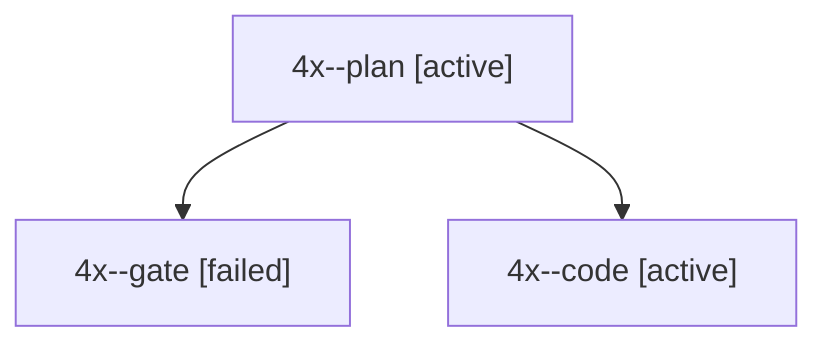

# Session: 4x

[Agent Hoods](../README.md) / [bbugyi200](../users/bbugyi200/README.md) / [apollo](../users/bbugyi200/machines/apollo/README.md) / [4x](../users/bbugyi200/machines/apollo/hoods/4x/README.md) / 4x

Owner: `bbugyi200.apollo` · Hood: `4x` · Members: 3

## Lineage

The diagram is an optional enhancement; the ordered table below contains the same lineage in accessible text.

| Role | Agent | State | Model / provider | Timing | Commits | Prompt | Chat |
|---|---|---|---|---|---:|---|---|
| plan | 4x--plan | active | grok-4.7 / grok | 2026-10-03T22:20:45.339901+00:00 | 0 | [Prompt](../agents/bbugyi200.apollo.4x--plan/prompt.md) | [Chat](../agents/bbugyi200.apollo.4x--plan/chat.md) |
| gate | 4x--gate | failed | grok-4.7 / grok | 2026-10-03T22:31:11.024763+00:00 → 2026-10-03T22:31:19.310383+00:00 | 0 | — | [Chat](../agents/bbugyi200.apollo.4x--gate/chat.md) |
| code | 4x--code | active | grok-4.6 / grok | 2026-10-03T22:32:00.973880+00:00 | 0 | — | — |
