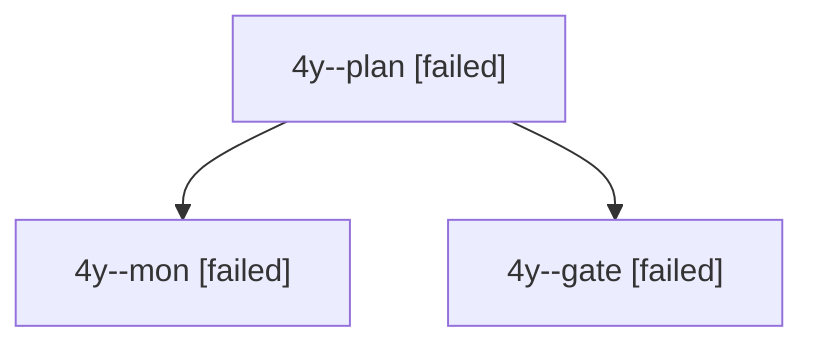

# Session: 4y

[Agent Hoods](../README.md) / [bbugyi200](../users/bbugyi200/README.md) / [apollo](../users/bbugyi200/machines/apollo/README.md) / [4y](../users/bbugyi200/machines/apollo/hoods/4y/README.md) / 4y

Owner: `bbugyi200.apollo` · Hood: `4y` · Members: 3

## Lineage

The diagram is an optional enhancement; the ordered table below contains the same lineage in accessible text.

| Role | Agent | State | Model / provider | Timing | Commits | Prompt | Chat |
|---|---|---|---|---|---:|---|---|
| plan | 4y--plan | failed | opus / claude | 2026-10-04T10:44:19.324105+00:00 → 2026-10-04T11:02:04.382715+00:00 | 0 | [Prompt](../agents/bbugyi200.apollo.4y--plan/prompt.md) | [Chat](../agents/bbugyi200.apollo.4y--plan/chat.md) |
| mon | 4y--mon | failed | opus / claude | 2026-10-04T11:01:59.331831+00:00 → 2026-10-04T11:02:47.122647+00:00 | 0 | — | [Chat](../agents/bbugyi200.apollo.4y--mon/chat.md) |
| gate | 4y--gate | failed | opus / claude | 2026-10-04T11:01:50.727848+00:00 → 2026-10-04T11:02:00.115031+00:00 | 0 | — | [Chat](../agents/bbugyi200.apollo.4y--gate/chat.md) |
