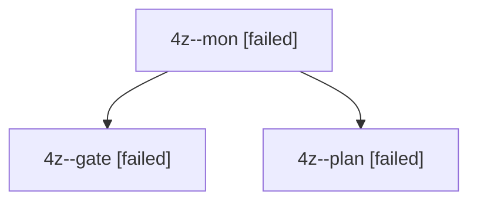

# Session: 4z

[Agent Hoods](../README.md) / [bbugyi200](../users/bbugyi200/README.md) / [apollo](../users/bbugyi200/machines/apollo/README.md) / [4z](../users/bbugyi200/machines/apollo/hoods/4z/README.md) / 4z

Owner: `bbugyi200.apollo` · Hood: `4z` · Members: 3

## Lineage

The diagram is an optional enhancement; the ordered table below contains the same lineage in accessible text.

| Role | Agent | State | Model / provider | Timing | Commits | Prompt | Chat |
|---|---|---|---|---|---:|---|---|
| mon | 4z--mon | failed | opus / claude | 2026-10-04T11:13:39.727227+00:00 → 2026-10-04T11:14:24.842788+00:00 | 0 | — | [Chat](../agents/bbugyi200.apollo.4z--mon/chat.md) |
| gate | 4z--gate | failed | opus / claude | 2026-10-04T11:13:33.227916+00:00 → 2026-10-04T11:13:40.382257+00:00 | 0 | — | [Chat](../agents/bbugyi200.apollo.4z--gate/chat.md) |
| plan | 4z--plan | failed | opus / claude | 2026-10-04T11:02:07.712781+00:00 → 2026-10-04T11:13:44.318530+00:00 | 0 | [Prompt](../agents/bbugyi200.apollo.4z--plan/prompt.md) | [Chat](../agents/bbugyi200.apollo.4z--plan/chat.md) |
