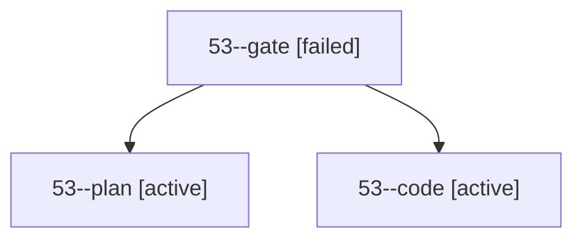

# Session: 53

[Agent Hoods](../README.md) / [bbugyi200](../users/bbugyi200/README.md) / [apollo](../users/bbugyi200/machines/apollo/README.md) / [53](../users/bbugyi200/machines/apollo/hoods/53/README.md) / 53

Owner: `bbugyi200.apollo` · Hood: `53` · Members: 3

## Lineage

The diagram is an optional enhancement; the ordered table below contains the same lineage in accessible text.

| Role | Agent | State | Model / provider | Timing | Commits | Prompt | Chat |
|---|---|---|---|---|---:|---|---|
| gate | 53--gate | failed | gpt-6.1-sol / codex | 2026-10-04T17:00:52.973126+00:00 → 2026-10-04T17:01:06.416521+00:00 | 0 | — | [Chat](../agents/bbugyi200.apollo.53--gate/chat.md) |
| plan | 53--plan | active | gpt-6.1-sol / codex | 2026-10-04T16:54:24.396635+00:00 | 0 | [Prompt](../agents/bbugyi200.apollo.53--plan/prompt.md) | [Chat](../agents/bbugyi200.apollo.53--plan/chat.md) |
| code | 53--code | active | grok-4.6 / grok | 2026-10-04T17:01:14.487622+00:00 | [1](../agents/bbugyi200.apollo.53--code/README.md#commits) | — | — |

## Commits

| Role | Repo | Commit | Subject | Committed |
|---|---|---|---|---|
| code | bob-cli | [`260a1fe`](https://github.com/bobs-org/bob-cli/commit/260a1fe928c82eb61de67c35924e303ef9551ca4) | docs(freshness): remap confirm-and-advance to Ctrl+Alt+F | 2026-10-04 13:10:46 EDT |
