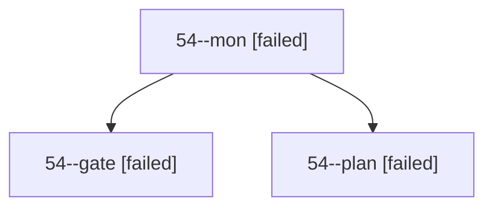

# Session: 54

[Agent Hoods](../README.md) / [bbugyi200](../users/bbugyi200/README.md) / [apollo](../users/bbugyi200/machines/apollo/README.md) / [54](../users/bbugyi200/machines/apollo/hoods/54/README.md) / 54

Owner: `bbugyi200.apollo` · Hood: `54` · Members: 3

## Lineage

The diagram is an optional enhancement; the ordered table below contains the same lineage in accessible text.

| Role | Agent | State | Model / provider | Timing | Commits | Prompt | Chat |
|---|---|---|---|---|---:|---|---|
| mon | 54--mon | failed | opus / claude | 2026-10-05T01:41:56.088058+00:00 → 2026-10-05T01:42:53.975702+00:00 | 0 | — | [Chat](../agents/bbugyi200.apollo.54--mon/chat.md) |
| gate | 54--gate | failed | opus / claude | 2026-10-05T01:41:49.167117+00:00 → 2026-10-05T01:41:56.733182+00:00 | 0 | — | [Chat](../agents/bbugyi200.apollo.54--gate/chat.md) |
| plan | 54--plan | failed | opus / claude | 2026-10-05T01:37:49.909638+00:00 → 2026-10-05T01:42:01.099784+00:00 | 0 | [Prompt](../agents/bbugyi200.apollo.54--plan/prompt.md) | [Chat](../agents/bbugyi200.apollo.54--plan/chat.md) |
