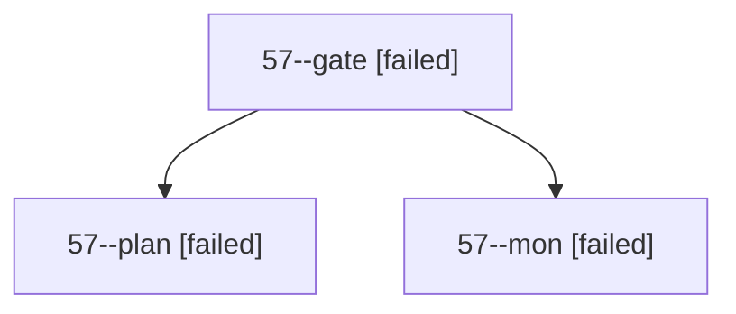

# Session: 57

[Agent Hoods](../README.md) / [bbugyi200](../users/bbugyi200/README.md) / [apollo](../users/bbugyi200/machines/apollo/README.md) / [57](../users/bbugyi200/machines/apollo/hoods/57/README.md) / 57

Owner: `bbugyi200.apollo` · Hood: `57` · Members: 3

## Lineage

The diagram is an optional enhancement; the ordered table below contains the same lineage in accessible text.

| Role | Agent | State | Model / provider | Timing | Commits | Prompt | Chat |
|---|---|---|---|---|---:|---|---|
| gate | 57--gate | failed | opus / claude | 2026-10-05T15:59:29.597438+00:00 → 2026-10-05T15:59:36.833510+00:00 | 0 | — | [Chat](../agents/bbugyi200.apollo.57--gate/chat.md) |
| plan | 57--plan | failed | opus / claude | 2026-10-05T15:45:14.061471+00:00 → 2026-10-05T15:59:41.076758+00:00 | 0 | [Prompt](../agents/bbugyi200.apollo.57--plan/prompt.md) | [Chat](../agents/bbugyi200.apollo.57--plan/chat.md) |
| mon | 57--mon | failed | opus / claude | 2026-10-05T15:59:36.159217+00:00 → 2026-10-05T16:00:23.010594+00:00 | 0 | — | [Chat](../agents/bbugyi200.apollo.57--mon/chat.md) |

## Commits

| Role | Repo | Commit | Subject | Committed |
|---|---|---|---|---|
| — | bob-cli | [`84b2c55`](https://github.com/bobs-org/bob-cli/commit/84b2c552efc6d493cb3493d026d94bd40bed3b7e) | chore: Add SDD prompt and plan for beautify\_highlights\_rendering | 2026-06-10 14:03:00 EDT |
| — | bob-cli | [`156a747`](https://github.com/bobs-org/bob-cli/commit/156a747cb65873f8538f5faa91db4a9ac36c51cd) | feat: beautify highlights note rendering | 2026-06-10 14:13:29 EDT |
